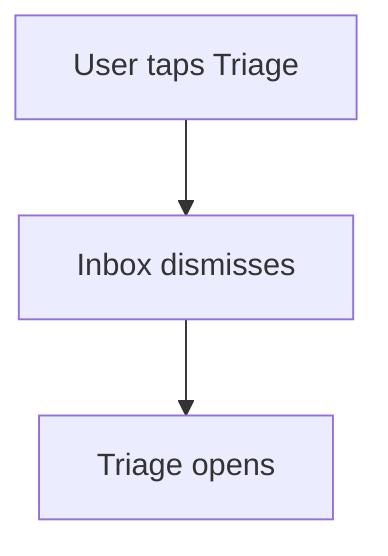
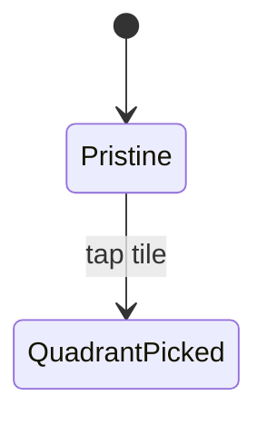

<!-- GENERATED from bankai-core@v0.11.2/handbooks/stacks/react-uzf-v1/rules/13-feature-documentation.md — DO NOT EDIT; change the handbook and re-run sync-canon. -->
# 13 — Feature Documentation

Implements **UZF-21** (language-agnostic feature spec) for the React 19 +
Redux Toolkit / UZF stack. Every feature that owns a feature flag or a
top-level entry point gets a living, **language-agnostic** spec at
`docs/Features/<FeatureName>.md`. The intent is that a designer, PM, or
engineer from any platform (iOS, Android, web) can read those docs and
understand *what* the feature does and *how* its parts relate — without ever
opening TypeScript.

This stack is **one family with two render targets**: apps/web (Next.js
App Router) and apps/mobile (absent, this repo is web-only) (Expo Router / React Native, Solito for
cross-nav). Slices, selectors, shifters, producers, services, and mappers
live once in packages/core and are shared by both render targets — so,
per UZF-21's cross-platform clause, a feature shipped to both apps/web and
apps/mobile (absent, this repo is web-only) still gets **one** spec, not two. Only the render/UI layer
differs, and that difference is a `## Web notes` / `## Mobile notes`
subsection inside the single spec, never a second file.

## Repo-specific placeholders

| Token | kro example |
| --- | --- |
| `docs/Features` | `docs/Features` |
| `featureFlags.ts` | `featureFlags.ts` (`export const FeatureFlags = { … } as const`) |
| `packages/core` | `packages/core` |
| `apps/web` | `apps/web` (Next.js 15 App Router) |
| `apps/mobile (absent, this repo is web-only)` | `apps/mobile` (Expo SDK 55 / Expo Router) |
| `packages/app/theme` | `packages/app/theme` (Tamagui config / design tokens; nests under `packages/app`, per `placeholders.md`'s token-reconciliation note) |

## Where docs live

```
docs/
  Features/
    <FeatureName>.md            # The feature specification — the only Markdown
                                # artifact per feature. Diagrams live INSIDE
                                # this file as fenced ```mermaid blocks
                                # (one or more).
    README.md                   # Optional: index of all features and flags.
    assets/                     # Optional shared screenshots / GIFs / PDFs.
                                # Per-feature assets can use a
                                # docs/Features/assets/<FeatureName>/ prefix.
```

- **One Markdown file per feature, flat under `docs/Features`.** No
  per-feature subfolder. Listing the Features directory in any editor
  produces a one-page menu of every spec.
- `docs/Features/README.md` (optional) indexes all features and their flag.
- File name is PascalCase and matches the conceptual feature name — **not**
  the implementation file name. Example: `docs/Features/Inbox.md`, not
  `docs/Features/InboxSlice.md` or `docs/Features/InboxScreen.md`.
- Pre-existing topical docs at the root of `docs/` (e.g. legacy kebab-case
  files such as `feature-card.md`) should migrate into this layout the next
  time their feature is touched.
- **No standalone `.mermaid` files.** They render only in editors that ship a
  dedicated mermaid extension. A ` ```mermaid ` fenced block inside a
  Markdown file is rendered out-of-the-box by GitHub, VS Code, Cursor, Zed,
  Warp's Markdown preview, Obsidian, and Typora — the common denominator.

## When a doc must exist (UZF-21)

A feature **must** have a doc file (`docs/Features/<FeatureName>.md`) if any
of these is true:

1. It is gated by an entry in the feature-flag registry (`featureFlags.ts`, in
   packages/core).
2. It owns a top-level entry point in the UI (a tab, a sidebar item, a route
   segment, a sheet/modal reachable from another feature) on **either**
   apps/web or apps/mobile (absent, this repo is web-only).
3. It is referenced by another feature's doc (i.e. it has a public-facing
   contract).

If a flag exists, the doc file name should match the flag's conceptual name
(e.g. flag `now` → `docs/Features/Now.md`; flag `googleCalendar` →
`docs/Features/GoogleCalendar.md`). **One feature flag = one doc file**
(UZF-21), even if the feature spans multiple screens, routes, or both render
targets.

## What goes in `docs/Features/<FeatureName>.md`

Markdown only. **No code blocks of implementation language.** Pseudocode or
interface sketches in a fenced ` ```text ` block are fine; concrete
TypeScript/JSX is not. The doc must remain readable for the iOS/Android team
(or a PM, or a designer) without translation.

The spec follows this skeleton (sections may be omitted when truly N/A —
note the omission):

```markdown
# <Feature Name>

## Purpose
One-paragraph statement of what the feature does for the user and *why* it exists.

## Feature flag
- Name: `<flagName>`
- Default state: enabled | disabled
- Rollout / sunset notes (if any)

## Entry points
Where the user starts using this feature (tab name, route, sheet, deep link,
push notification, etc.). Note per render target if they differ (e.g. a tab
on mobile vs. a sidebar item on web).

## Core concepts
Domain vocabulary used by the feature. Each term gets one line. Do NOT
reference type names from the codebase — name the concept the user / PM
would name.

## User flows
Numbered list of the canonical flows. For each: trigger → steps → outcome.
Include the unhappy paths (offline, empty, permission denied).

## States
The high-level states the feature can be in (e.g. *idle*, *loading*,
*triage-empty*, *triage-with-cards*). Describe what the user sees in each.

## Interactions with other features
For each related feature, state the direction and shape of the interaction
(delegated event, shared model, navigation).

## Out of scope
What this feature does NOT do. Crucial when other docs link in.

## Open questions
Bulleted list. Each is owned by a person and dated.
```

The spec is **stateful**: it should always describe the *current* product
behavior, not the change history. Use git for history.

## How diagrams live inside the spec (UZF-21)

Every diagram lives as a fenced ` ```mermaid ` block **inside**
`docs/Features/<FeatureName>.md`. A typical spec has one ` ```mermaid ` block
per concern (one for the user flow, one for the state machine, one for a
cross-feature handshake) — each preceded by a small `### <Concern>` heading
so readers can navigate.

Example placement (replace the contents with the real diagram):

````markdown
## Diagrams

### User flow



### States


````

Pick the right diagram type per block:

- **flowchart** (`flowchart TD`) — user flows or navigation graphs. The
  default.
- **stateDiagram-v2** — features modelled as a finite-state machine
  (sessions, onboarding).
- **sequenceDiagram** — cross-feature handshakes (e.g. Add for Today → Plan)
  or a web↔mobile handshake mediated by a shared packages/core slice.
- **erDiagram** — domain relationships that affect more than one feature.

Each diagram must:

- Use plain English in node labels — no code identifiers.
- Be renderable from raw mermaid (no external themes, no extension syntax).
- Stay in sync with the surrounding prose — if you change one, change the
  other in the same PR.

Multiple diagrams per spec are encouraged when one combined diagram would be
unreadable. There is no separate diagram file to keep in sync; everything is
one markdown.

## Authoring rules

1. **Language-agnostic (RC-60).** No file paths, type names, function names,
   or framework references. In this stack, that specifically bans the
   React/Redux Toolkit identifiers from a feature doc — `useSelector`,
   `useDispatch`, `createSlice`, `createAsyncThunk`, `createSelector`, `RTK
   Query`, `endpoint`, `Slice`, `Thunk`, `Solito`, `Tamagui`, `JSX`/`TSX`,
   `hook`, `.tsx`/`.ts` — and their Compose/SwiftUI equivalents when a
   cross-platform doc is edited from this stack (`@Composable`,
   `@HiltViewModel`, `StateFlow`, `MainActor`). Describe behavior, not
   implementation.

   Exception: ` ```mermaid ` fenced blocks are explicitly allowed (and
   expected) — they are diagrams, not implementation code. They must still
   use plain-English labels, never code identifiers.
2. **No screenshots without alt-text and date.** Visuals decay fast; the
   file name should be `YYYY-MM-DD-<short-label>.png`.
3. **Cross-link.** Use relative links (`./Search.md`) when referencing
   siblings — they live in the same folder now.
4. **One source of truth.** If the spec disagrees with the code, the spec is
   wrong. Fix the spec immediately.
5. **One PR = code + docs.** Behavior changes to a flagged feature **must**
   update its doc in the same PR (UZF-23). See
   [12-session-completion-checklist.md](12-session-completion-checklist.md).
6. **Keep it short.** A typical feature doc is 1–3 pages of markdown plus one
   diagram. If it grows past five pages, split into sub-features or move
   detail into other docs.
7. **Shared-core changes update the one spec, not a per-target copy.** A
   behavior change made purely in packages/core (a slice, a selector, a
   producer's decision logic) still updates the single
   `docs/Features/<FeatureName>.md` — it is cross-platform canon regardless
   of which render target's code changed. Only a rendering-layer-only
   difference (e.g. a gesture that exists on mobile but not web) belongs
   under that render target's notes subsection.

## What NOT to put in feature docs

- Implementation snippets, file paths, type names. Those rot. Use git.
- Test plans. Tests are co-located `*.test.ts`/`*.test.tsx` files across
  packages/core, apps/web, and apps/mobile (absent, this repo is web-only), plus Storybook stories —
  they are the source of truth, not the spec (RC-60).
- Release / sprint notes. Those belong in the changelog.
- Design tokens or palette specs. Those live in packages/app/theme (Tamagui
  config) (RC-60).
- Stale or aspirational behavior. If it's not shipped, mark it explicitly as
  **Planned**.

## Relationship to other rules

- **Engineering rules** (UZF architecture, artifact shapes, forbidden
  patterns) live in the stack handbook (`architecture.md`, `RC-*`) and
  bankai-core (`UZF-*`) — those are *how code is structured*, not product
  features.
- **Operational rules** (this file and the rest of `.claude/rules/`,
  including `12-session-completion-checklist.md`) describe *how to work* in
  this repo.
- **Feature documentation** describes *what the product does*.

If a feature crosses render targets (web + mobile, both fed by the same
packages/core slice), the same `docs/Features/<FeatureName>.md` file is
the canon (UZF-21). Render-target-specific notes go inline in the spec under
a `## Web notes` / `## Mobile notes` subsection. We do not duplicate feature
docs per render target, and we do not duplicate them per platform if the
same product also has an iOS/Android app on a different stack — that cross-
stack canon question is a `bankai:handbook-question`, not a second file
authored unilaterally here.
