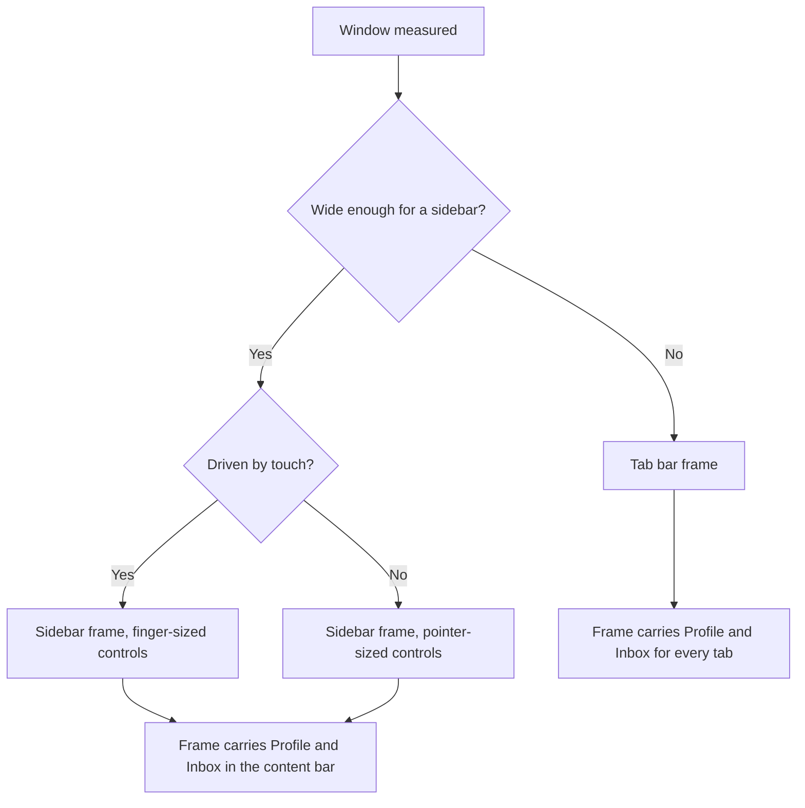
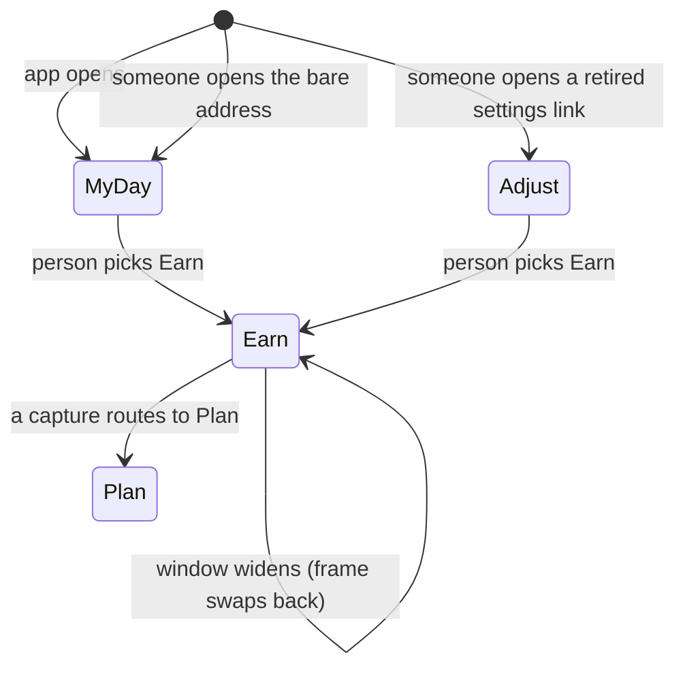
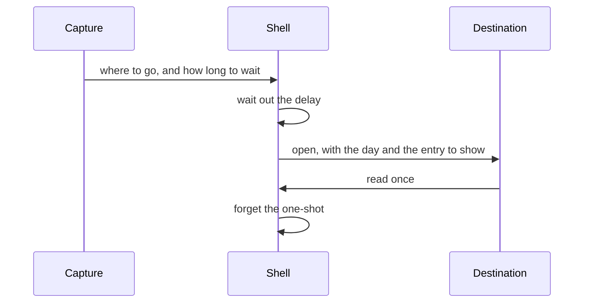

# App Shell

## Purpose

The app shell is the frame every other part of Kro Web is seen through. It
decides — from the size of the window and the kind of pointer driving it —
whether the person gets the phone's flat tab bar or the desktop's sidebar, it
holds which destination is selected, and it carries the handful of controls
that belong to the frame rather than to whatever is inside it.

It exists so that the phone experience and the desktop experience are the same
two experiences Kro already ships on iPhone and on Mac, rather than a third,
web-shaped guess.

## Feature flag

The shell itself is not flagged — it is the frame, and there is no state in
which the app has no frame. Each **destination it offers** is flagged, and the
shell reads the same registry every other platform reads:

| Destination | Flag | Ships as |
| --- | --- | --- |
| My Day, All Tasks, Jot Down | `tasks` | on |
| Plan | `day` | on |
| Execute | `session` | on |
| Earn | `rewards` | on |
| Adjust | `settings` | on |
| Lists | `lists` | on |
| Priority Matrix | `matrix` | off |
| Habits | `habits` | off |
| Board | `board` | off |
| Blueprints | `blueprints` | off |

Tweak is a development-build destination and has no flag: it appears only when
the app is not built for production.

## Entry points

Every destination is a link people can paste, bookmark or reload:

`/my-day` · `/tasks` · `/inbox` · `/matrix` · `/plan` · `/habits` ·
`/execute` · `/board` · `/earn` · `/blueprints` · `/adjust` · `/tweak` ·
`/search` · `/lists/<project>`

**The bare address is the front door.** Opening Kro Web with no destination in
the address — the site's root, and what the installed app opens on — lands on
**Today**, the same destination the Mac's sidebar and the iPad's navigation open
on first launch. It is a hand-off, not a page: nothing is shown at the root
itself.

Two addresses from before the shell existed still resolve, so an old bookmark or
a link someone shared never lands on nothing:

| Old address | Lands on | Why |
| --- | --- | --- |
| `/settings` | **Adjust** | Adjust *is* the settings surface. |
| `/integrations` | **Adjust** | Connecting a calendar is a pane inside the settings hub, not a place of its own. |

The shell also arrives at a destination on its own when a capture routes there
— see *Interactions with other features*.

## Core concepts

- **Surface** — what the window currently is: touch or pointer, narrow or
  wide. Two questions, four answers, and everything adaptive is decided from
  them.
- **Shell shape** — the frame that surface gets. Narrow gets the tab bar; wide
  gets the sidebar. There is no third shape.
- **Destination** — a place in the app. It has a short name for the navigation
  row and a longer one for the content heading; those differ on purpose
  ("Today" in the sidebar, "My Day" above the content).
- **Selection** — the destination currently being shown. It belongs to the
  shell, not to either frame, which is why it survives a resize.
- **Toolbar slot** — a place in the frame's own bar that whatever is inside can
  put a control into. The frame never decides what those controls are.
- **Ownership** — whether a control belongs to the frame or to the content.
  The rule is that it follows the *container*: a frame with a tab bar carries
  Profile and Inbox once for every tab, so the content must not repeat them.

## User flows

1. **Landing.** Open the app at any destination link → the shell measures the
   window, picks a frame, and shows that destination with its row highlighted.
   Without a link, the landing destination is My Day.
2. **Choosing a destination.** Tap a sidebar row or a tab → the highlight moves
   at once, the address changes, and the destination appears. Using the browser
   Back button does the same thing in reverse.
3. **Resizing across the boundary.** Drag a desktop window narrow → the sidebar
   is replaced by the tab bar, the touch-sized controls take over, **and the
   same destination stays selected**. Widening does the reverse.
4. **Searching.** Type in the sidebar's search field and press Enter, or tap
   the Search affordance beside the tabs → the Search destination opens.
5. **Managing lists.** Tap "+" → an inline row appears; type a name and press
   Enter → the project is created and the row closes. Escape abandons it. Each
   project row offers a delete.
6. **Unhappy paths.** If the lists cannot be read from the device the rest of
   the frame still renders and the failure is reported rather than shown as an
   empty list. A project name that is only spaces is refused, and nothing is
   written.

## States

- **Starting up** — the frame is drawn, but no destination rows are yet shown:
  which destinations exist depends on flags the shell has not finished reading.
  This lasts a moment and never flashes a destination the build has staged off.
- **Ready** — rows and tabs are shown, one of them highlighted.
- **Lists unavailable** — everything renders except the Lists section, and the
  failure is recoverable.
- **Collapsed** — on the wide frame the sidebar can be put away; the content
  and its toolbar remain.

## Interactions with other features

- **Capture.** When something is captured, capture decides where the person
  should end up and how long to wait first. The shell performs that: it waits
  out the delay, opens the destination, and hands the destination the details
  it needs (which day to show, which entry to bring into view, whether to mark
  it as just created). The shell owns the one-shot; the destination reads it
  once.
- **Every feature that owns a destination.** The frame renders the destination
  inside itself and offers it slots in its own bar. Until a feature is built
  its destination shows a placeholder naming itself.
- **Flags.** The shell shows a destination only when its flag is on, and it
  falls back to My Day if the destination being shown disappears.
- **Settings and profile.** The frame's Profile control opens Adjust for now;
  the profile panel itself belongs to the settings work.

## Out of scope

- The content of any destination — each is its own feature.
- Floating action buttons, toasts and the session pill.
- The settings panel's own contents.
- The pre-parity surfaces (the old landing page, the standalone session page)
  which keep their own frame until they are retired.

## Diagrams

### Choosing a frame

### Selection across a resize

### A capture arriving

## Open questions

- Profile currently opens Adjust; the panel it should open belongs to the
  settings work. Owner: maintainer, 2026-08-31.

*(Settled 2026-09-01: the root address does land on Today, and the hand-off is
described under **Entry points**. The pre-parity landing page it was waiting on
is gone.)*
