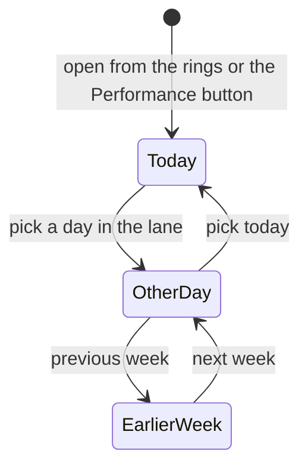

# Day Progress

> Cross-platform canon: KroApple `docs/Features/DayProgress.md`. Web-only
> differences are under **Web notes**.

## Purpose

A day at a glance: how the day's habits and tasks went, and every session or
completion recorded on it, across all endeavors.

## Feature flag

- None of its own. It is reached through the trailing detail pane
  (`macDetailPane`, [MacDetailPane.md](./MacDetailPane.md)).

## Entry points

- The **activity rings** in the Do header.
- The pane's **Performance** button while the pane is reading the whole day.

## What it shows

- **Date line**: "Today · Thu, Sep 24", "Yesterday · …", or the date itself.
- **Week lane**: the seven days ending today, each with its day letter, small
  rings and the date. The selected day is highlighted and today is in red.
  Previous week and next week move a whole week at a time, as far back as the
  data goes (45 days) and never into the future.
- **Rings**: a gold habits ring (only when the day has habits) and an emerald
  tasks ring. Next to them, a tally for each: "Habits" / "Tasks", "x/y", "DONE".
  "Nothing planned for this day." when there were no tasks.
- **Activity**: a count, then one card per performance that ended on that day,
  newest first. Each card shows the endeavor's emoji and title, the time range,
  a duration pill, the outcome and the reward points.

## States

- **Loading**: "Loading your day…" / "Loading activity…"
- **Empty**: "No activity yet" / "Complete a task or run a session and it will
  show up here."

## Web notes

- Canon's deferred and missed rows are not shown. The web does not record
  those yet.
- Canon's share button and the points ("Day Recollection") variant are not on
  the web yet.
- The "Today" and "Yesterday" prefixes are English in every locale.
