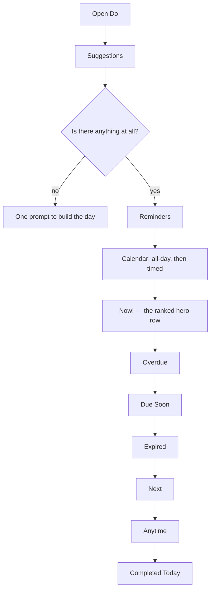
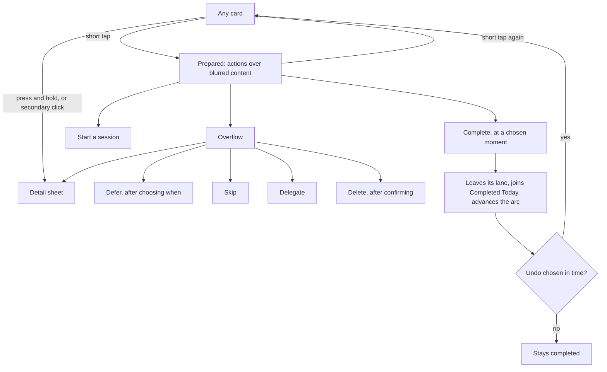
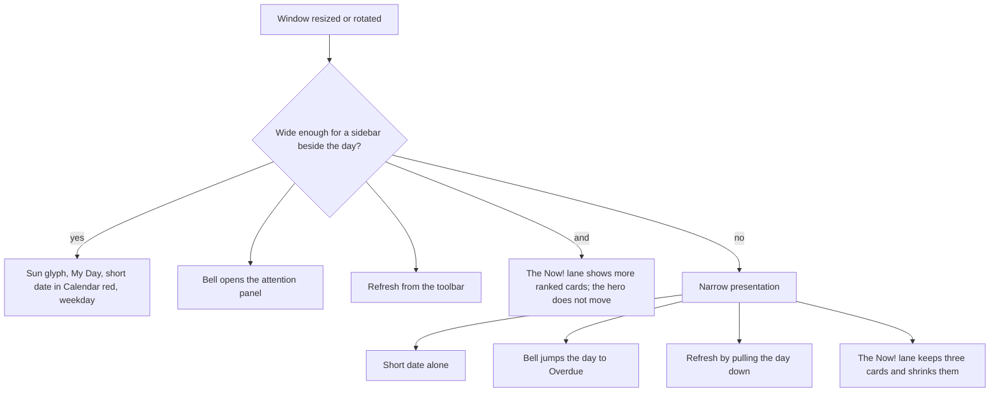
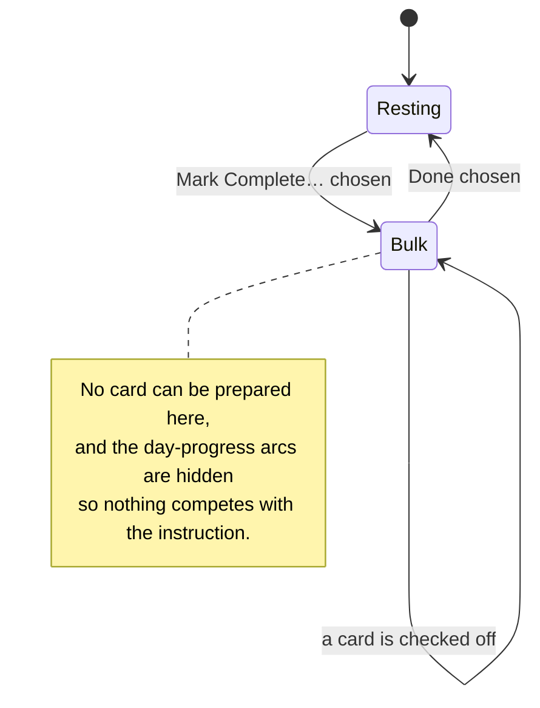

# Do

## Purpose

Do is the daily execution surface — the one place that answers "what am I doing
now?" It groups today's actionable work by how urgently it wants attention,
keeps reminders and calendar events visible in forms suited to them, and puts a
one-tap route from any card into starting, completing, deferring or dismissing
the thing it stands for.

It is the flagship of Kro Web's parity promise: the same day, the same
grouping, the same gestures the Kro apps already show on a phone and on a
desktop.

## Feature flag

- The Do surface itself is foundational and always available. Presenting the
  same day on the device someone happens to be holding is *parity*, not a new
  capability, so nothing about how it adapts is staged behind a switch.
- The day-progress rings follow their own kill switch, `doActivityRings`,
  which ships **on**. It exists so the readout can be turned off, not so it can
  be rolled out.
- The Suggestions lane follows the `do.showSuggestions` preference, and the
  Google Calendar nudge inside it additionally follows the `googleCalendar`
  flag.
- Opening a card's Detail follows the disabled-by-default `endeavorDetail`
  rollout flag, which is that feature's own.

## Entry points

- **Do**, the third tab, on a narrow window.
- **Today**, the first sidebar row, on a wide one — where the content heading
  reads **My Day**.
- The address `/my-day`, which is a link anyone can paste, bookmark or reload.
- A section's count badge, which opens that one section as a full vertical
  list without leaving Do.

## Core concepts

- **Lane** — one horizontal row of cards, grouped by how today relates to it.
  Do shows them in one fixed order, top to bottom: Suggestions, Reminders,
  Calendar, **Now!**, Overdue, Due Soon, Expired, Next, Anytime, Completed
  Today. A lane with nothing in it is not shown at all.
- **The Now! lane** — the ranked hero row. The highest-priority piece of work
  sits at the centre of the ranked sequence and is drawn larger; the rest fill
  outward around it. The row starts at the standard leading inset and never
  centres itself or stretches to absorb spare width, so widening the window
  reveals more ranked work without moving the emphasised card. A genuinely
  narrow phone shrinks the cards proportionally rather than clipping them; the
  gap between cards never changes.
- **Card preparation** — a short tap on a card blurs its content and floats its
  actions over it: complete, start, and an overflow for everything else. A
  second tap puts it back. At most one card is prepared at a time.
- **Detail request** — a press-and-hold, a secondary click, or the overflow
  menu's Details row asks for that endeavor's read-optimised Detail sheet,
  without changing what a short tap does.
- **Bulk mark-complete mode** — every card wiggles and grows a corner control,
  the header retitles to an instruction, the day-progress readout steps aside,
  and a single Done control replaces the rest of the toolbar.
- **Day progress** — two concentric arcs in the header: habits outside, tasks
  inside. A category that expected nothing today draws no arc at all, because
  an empty track would read as "you have done none of them".
- **Attention updates** — the bell reports how many things have missed their
  deadline. Where there is room beside the day it opens a panel listing them; a
  second tap closes it and it never opens empty. Where there is not, it jumps
  the day to the Overdue lane instead — and then it only ever announces the
  overdue count, because that is all the jump can reach.
- **Refresh** — a pull on a touch surface, a toolbar control on a pointer one.
  While the refresh is in flight the control keeps its exact footprint and
  swaps its glyph for an activity indicator.
- **Visibility** — which kinds, states and sources contribute cards. It changes
  the lanes and deliberately does **not** change the rings: progress through the
  day is a fact about the day, not about what is currently being looked at.
- **Window width, not device class** — every adaptive choice follows how wide
  the window is and whether a finger or a pointer is driving it. Resizing
  changes the presentation live.

## User flows

1. **Read the day.** Open Do. The header names the day and how much is left;
   the lanes below it are already laid out, before any refresh returns.
2. **Prepare and start.** Briefly tap a card. Its actions appear over it.
   Choosing Start hands the endeavor to the session surface.
3. **Complete something.** Choose the check. A small panel offers the moment it
   was finished, defaulting to now; confirming closes the endeavor. It leaves
   its lane and appears in Completed Today in the same moment, the day-progress
   arc advances, and a message offers **Undo** for a few seconds.
4. **Undo a completion.** Choose Undo before the message goes. The endeavor
   returns to the lane it came from and the arc falls back.
5. **Defer, skip, delegate or delete.** Open a prepared card's overflow. Defer
   and Delete each open their own confirmation — reaching an action by the menu
   never skips the step the direct control exists for.
6. **Inspect anything.** Press and hold any card, or secondary-click it. The
   Detail sheet opens for that endeavor.
7. **Expand a section.** Tap a lane's count badge. That section opens as a full
   vertical list of the same cards, laid out as rows, with a back control.
8. **Check everything off at once.** Choose *Mark Complete…* from the quick
   action button. Every card grows a control; tapping one completes it without
   preparing it first. Done leaves the mode.
9. **Clear what expired.** Choose *Clear Expired*. Every endeavor past due on an
   earlier day is acknowledged and closed, and the day is re-read once so a
   recurring item's occurrence for today can take its place. Nothing
   half-cleared is ever shown.
10. **Attend to what slipped.** Tap the bell. On a wide window a panel lists the
    overdue and expired work; on a narrow one the day jumps to Overdue.
11. **Start the day empty.** With nothing anywhere, Do offers one prompt to
    connect a calendar or create the first endeavor, instead of a list of empty
    lanes.

## States

| State | What is on screen |
| --- | --- |
| Resting | Lanes of cards, nothing prepared |
| Prepared | One card blurred behind its actions |
| Bulk mark-complete | Every card wiggling with a corner control; instruction in the header; no rings |
| Section expanded | One section as a vertical list, over the day |
| Attention panel open | Overdue and expired listed beside the day (wide windows only) |
| Refreshing | The retained day, with the refresh control showing activity |
| Refresh failed | The retained day, plus one message offering to try again |
| Empty | One prompt to build the day |

## Interactions with other features

- **App shell** — owns the frame, the window measurement and the two toolbar
  groups Do fills. It carries Profile and Inbox; Do never adds a second copy.
- **Endeavor Detail** — receives the endeavor behind any Do card and returns
  saved changes to it.
- **Session** — receives an endeavor when Start is chosen, and is where the
  quick action button's *Start Session* leads.
- **Capture** — receives *Quick Add*, and the empty state's create prompt.
- **Google Calendar** — supplies today's events; its connect nudge is the
  Suggestions lane's only card.

## Out of scope

- Deciding which lane an endeavor belongs to. That is the day's own grouping
  rule, shared with the other Kro apps.
- Choosing who a delegated endeavor goes to. Do records that it was delegated;
  naming a person is not part of this product yet.
- Filtering by calendar. The calendar list belongs to the calendar integration
  and the Visibility panel gains that section with it.

## Diagrams

### Lane order

### Card interaction

### Width adaptation

### Bulk mark-complete

## Open questions

- Delegation records only that something was delegated. Who it went to needs a
  person model this product does not have yet. — owner: Sergio, 2026-08-31
- The Visibility panel offers kinds, states and sources. Calendars arrive with
  the calendar integration. — owner: Sergio, 2026-08-31
