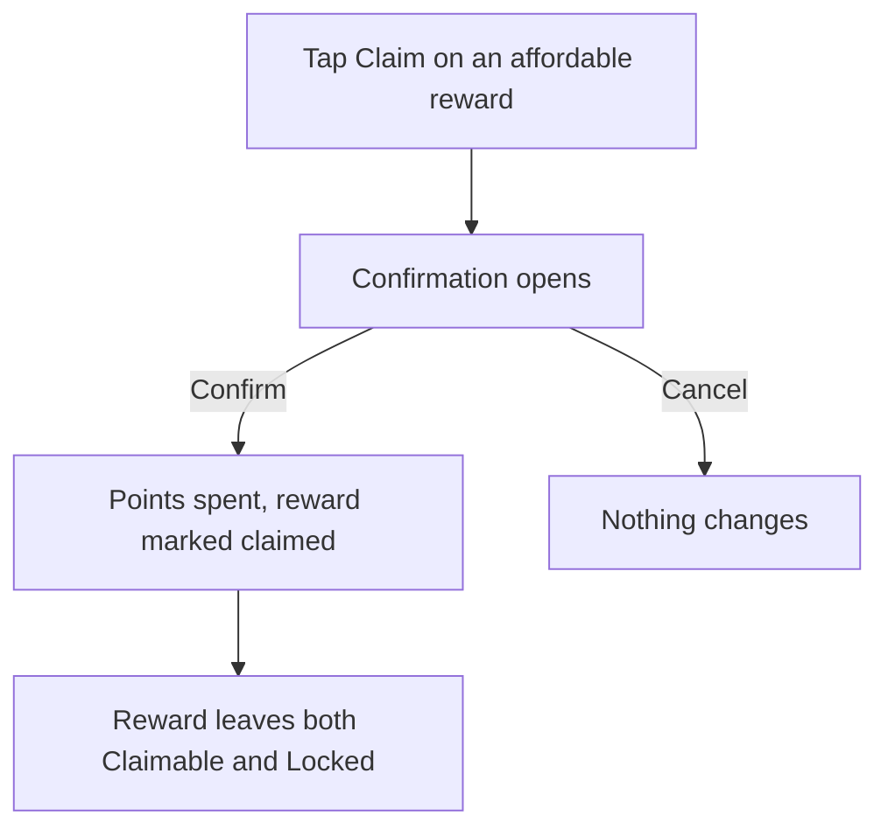
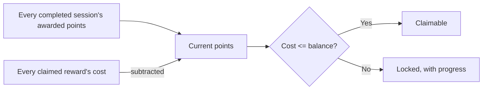

# Earn

## Purpose

Earn is where a person spends the points their focused work earns them. It
shows a catalog of self-defined rewards, splits them by whether there is
enough balance to claim one right now, and lets someone add a new reward or
claim an existing one. It is what gives a completed session its meaning
beyond the completion itself — the loop closes here.

## Feature flag

- Name: `rewards`
- Default state: enabled (part of `statusQuoSet`)
- Not gated a second time by this destination: whether Earn is reachable at
  all is decided once, at the navigation level (the sidebar row / tab only
  appears when `rewards` is on — App Shell's own doc). This feature assumes
  it is being shown and adds no flag check of its own.

## Entry points

- **Mobile** — the "Earn" tab in the bottom bar.
- **Desktop** — the "Earn" row under Workflow in the sidebar.
- Both resolve to the `/earn` route, a real, linkable, bookmarkable address.

## Core concepts

- **Reward** — something a person defined for themselves: a title, an emoji,
  a point cost, and an optional note on why it matters. Independent of any
  task or endeavor.
- **Current points** — the live balance: every point ever earned by a
  completion, minus every point already spent on a claimed reward. Never a
  stored running total — always the same two numbers, added and subtracted
  fresh, so it can never drift from what actually happened.
- **Claimable** — a reward whose cost the current balance can already cover.
  A free reward (cost of zero) is always claimable, regardless of balance.
- **Locked** — a reward still out of reach, shown with its progress toward
  its own cost and how many points remain.
- **Suggestion** — an unclaimed idea from a starter catalog, offered when it
  is not already something the person's own catalog has by name. Suggestions
  never cost the person anything to see; adding one copies it into their own
  catalog.
- **Claim** — spending points to mark a reward as claimed. Irreversible from
  the surface itself; a claimed reward leaves both the claimable and locked
  lanes.

## User flows

1. **Browsing.** Open Earn → the current balance is shown at the top, then
   up to three sections in order: rewards affordable now, rewards still
   being worked toward (with a progress bar and "N to go" each), and
   suggestions/starter ideas. A section with nothing in it does not appear.
2. **Claiming.** Tap Claim on an affordable reward → a confirmation opens
   naming the reward, its cost and what claiming does → confirm spends the
   points and the reward disappears from the catalog; cancel changes
   nothing. The confirmation is a bottom sheet on a narrow window and a
   popover anchored to the same button on a wide one — same content, two
   presentations.
3. **Adding a reward.** Tap the "+" button → a form opens with the title
   field focused, an emoji field, a point-cost stepper prefilled from the
   person's own default-cost preference, and an optional note → Add commits
   it to the top of the catalog; a blank title cannot be submitted. Same
   sheet/popover split as claiming.
4. **Adopting a suggestion.** Tap Add on a suggestion → it is copied into the
   person's own catalog at the top, keeping the suggestion's title, glyph and
   cost but taking on a fresh identity and timestamp.
5. **Removing a reward.** Right-click (or the row's own menu affordance) →
   Remove from list → the reward is gone; if it had been claimed, it no
   longer counts as spent, so removing an already-claimed reward returns its
   cost to the balance.
6. **Starting from nothing.** A catalog with no rewards yet still shows every
   available suggestion, headed by copy that names the "+" button as the way
   to add something of one's own.
7. **A refresh that fails.** If reloading the catalog fails after one was
   already showing, the catalog on screen is left exactly as it was — a
   failure never blanks a surface that had something to show.

## States

- **Loading** — first read of the catalog and preferences; nothing to show
  yet.
- **Loaded** — the ordinary state: balance plus whichever of the three
  sections are non-empty.
- **Failed, catalog kept** — a later read failed; the last good catalog
  stays on screen.
- **Add-reward open** — the form is showing, prefilled from the
  default-cost preference.
- **Claim-confirm open** — the confirmation is showing for one specific
  reward.

## Interactions with other features

- **Sessions.** Every completed session's awarded points are what the
  balance sums — Earn reads them, it never awards them itself.
- **Settings.** The Add-Reward form's default cost comes from a
  preference (`earn.defaultRewardThreshold`); the points formula itself is
  surfaced read-only and is set elsewhere.
- **App Shell.** The shell owns the "Rewards" heading and, on the phone tab
  bar only, a second gear shortcut beside it — tapping it is meant to open
  Earn's own settings section. That section does not exist yet (tracked
  below), so today the gear opens the general settings destination instead,
  the same stand-in the shell already uses for its Profile control.

## Out of scope

- The points formula itself (session feature).
- Earn's own settings/preferences screen (its own future feature) — this
  surface only reads the one preference it needs.
- Weekly challenges or milestones — declared in the flag registry, not
  built.

## Diagrams

### Claiming a reward

### The balance

## Open questions

- Whether the reward catalog should survive sign-out on a shared device, or
  be wiped along with every other device-stored preference — this web
  surface wipes it (privacy-consistent); the iOS canon currently does not.
  Tracked cross-platform, not decided here.
- The per-tab settings gear's real destination (Earn's own preferences
  section) does not exist yet; it currently opens the general settings
  destination instead. Owner: whoever builds Auth + Settings UI.
