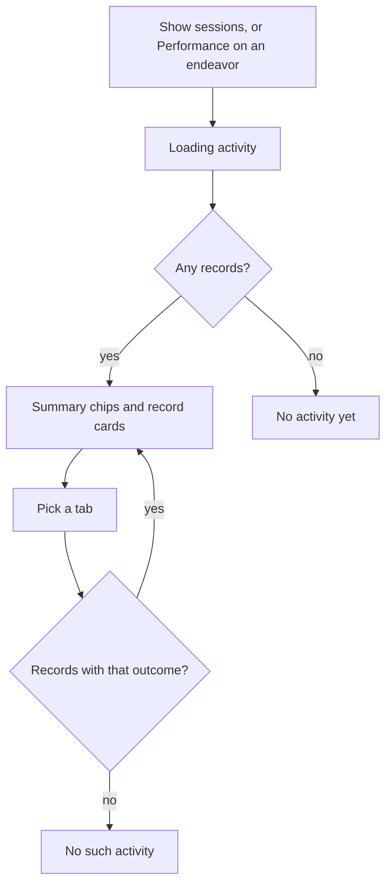

# Endeavor Activity

> Cross-platform canon: KroApple's Endeavor Activity screen. Web-only
> differences are under **Web notes**.

## Purpose

Shows every session recorded for one endeavor, newest first, so the user can
see how their work on it has gone.

## Feature flag

- None of its own. It is reached through the trailing detail pane
  (`macDetailPane`, [MacDetailPane.md](./MacDetailPane.md)).

## Entry points

- **Show sessions** in Session Setup's header, as a drill-in: Back returns to
  the session.
- The pane's **Performance** button while the pane is reading an endeavor.

## Core concepts

- **Record**: one recorded session (or a hand-logged performance) of the
  endeavor.
- **Outcome**: how the record ended. *Complete* means the session ended but the
  task stayed open, *Session finished* means the task was finished, and
  *Aborted* means the session was abandoned.

## What it shows

- A header with the endeavor's emoji and title, and "Every activity recorded
  for this endeavor."
- When there are records, three summary chips: the number of records, their
  total time, and their total reward points.
- Tabs: **All**, **Complete**, **Finished**, **Aborted**.
- One card per record, newest first by the time it ended. Each card shows:
  - the date and time range, such as "Sep 24 · 9:00–9:25";
  - the time spent: "No timer", "Ns", "Nm" or "Nh Mm";
  - the outcome;
  - the reward points.

## States

- **Loading**: "Loading activity…"
- **Empty, All tab**: "No activity yet" / "Recorded activity will appear here."
- **Empty, another tab**: "No complete activity" (and so on) / "Choose another
  resolution to see its records."
- **Kinds without sessions**: "Sessions don’t apply". For behaviors: "Not
  supported yet".

## Web notes

- Canon also has **Skipped** and **Missed** tabs. The web cannot record those
  outcomes yet, so the tabs are left out until it can.
- Canon's swipe actions (Edit and Delete a record) are not on the web yet.

## Out of scope

- Adding a record by hand from this screen.
