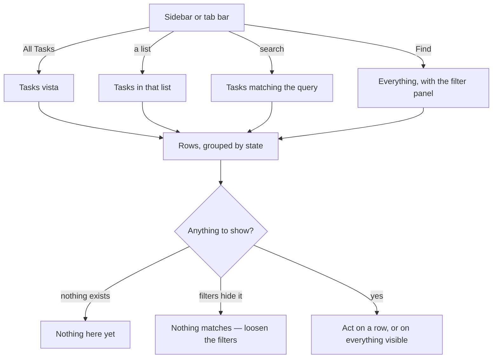
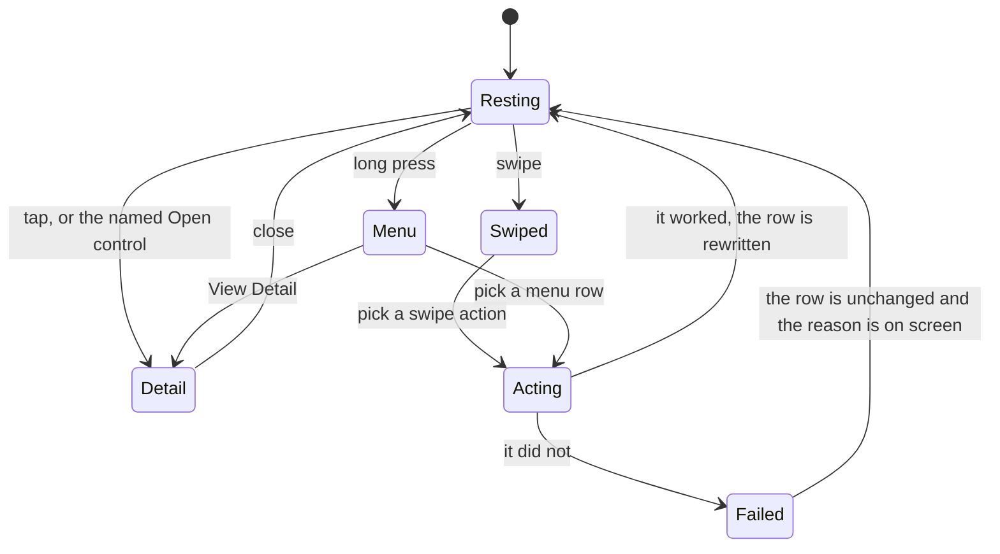

# Find

## Purpose

Find is where a person goes looking for something rather than being shown it.
Do answers "what am I doing now?" and Plan answers "what does today look like?";
Find answers "where did that go?" — across every kind of item, every source, and
every state including the ones the daily surfaces deliberately hide.

It is one browser wearing two hats. **Find** is the whole library with a rich
set of filters exposed. **All Tasks** is the same browser pointed at tasks, and
it is what a list, a search result and the Tasks tab all are — one surface with
a different question asked of it.

## Feature flag

- Name: `tasks`
- Default state: **enabled**
- One capability inside it is separately gated: opening an item's **detail**
  from a whole-row tap waits on `endeavorDetail`, which ships **off** while the
  detail screen is being finished on iPhone. Detail is still reachable, from a
  named control beside the row and from the row's long-press menu, so the gate
  is not worked around — the extra affordance is simply always there.

## Entry points

- **All Tasks**, from the sidebar or the tab bar.
- **A list**, from the sidebar's Lists group. Same surface, narrowed to the
  items filed under that list.
- **Search**, from the sidebar's search field. Same surface, narrowed to what
  was typed.
- **Find**, the whole-library browser with its filter panel.

Each is a link that can be pasted, bookmarked or reloaded, and each comes back
to the same rows with the same filters.

## Core concepts

- **Vista** — the question a surface is asking: everything, tasks, tasks in a
  list, tasks matching a search. A vista carries the query, what may be
  filtered, and which gestures a row offers.
- **Lens** — the person's own narrowing on top of the vista: kinds, sources,
  states, a search string, whether finished items are shown.
- **Lens memory** — a lens is remembered per vista, so returning to a list finds
  the filters that were left there.
- **Row** — one item, with the gestures its vista declares: swipe to start or
  edit, swipe to delete or archive, a long-press menu, and a tap.
- **Group** — rows are shown under headings, most often by state.
- **Bulk action** — delete or archive *everything currently visible*, which is
  why what is visible matters so much.

## User flows

1. **Browse everything.** Open Find. Every item appears, grouped by state.
2. **Narrow it.** Open the filter panel and switch kinds, sources or states off
   and on; type in the search field. The rows follow immediately, and the
   choices are remembered for next time.
3. **Tell "nothing here" from "nothing matches".** Two different empty states,
   with two different messages: one says there is nothing at all, the other says
   the filters are hiding it and offers to loosen them.
4. **Open a list.** Pick a list in the sidebar. The surface shows the items
   filed under it, under that list's name.
5. **Search.** Type in the sidebar's field and submit. The surface shows what
   matched, with the query still visible and editable.
6. **Act on one row.** Swipe it, long-press it, or use the controls that appear
   beside it on a pointer device: start a session on it, edit it, archive it,
   delete it, hand it to somebody else, or open its detail.
7. **Hand a row to somebody else.** Choose Share. On a device with a share
   sheet, the sheet opens with a short message naming the item; on one without,
   the message goes to the clipboard and the surface says so.
8. **Act on everything visible.** The overflow menu offers *Delete all visible*
   and *Archive all visible*, naming the count. Both apply immediately, with the
   destructive one marked as such — there is no second confirmation, which is
   deliberate and matches the other Kro apps.
9. **Something failed.** The rows stay exactly as they were and a message names
   what went wrong. Nothing is quietly rolled back and nothing is quietly kept.

## States

| State | What the person sees |
| --- | --- |
| *Loading* | The surface's frame with its rows still arriving. |
| *Loaded* | Rows, grouped, with each group's count. |
| *Nothing at all* | An invitation, not an error: there is genuinely nothing to show. |
| *Nothing matches* | A different message, naming the filters as the reason and offering to loosen them. |
| *Failed* | The retained rows plus a message. A failure never empties the screen. |
| *Acting* | The row is being written; the rest of the surface stays usable. |

## Interactions with other features

- **App shell** — Find is a destination the shell offers, and the sidebar's
  Lists group and search field both open it.
- **Detail** — a row's tap, its long-press menu and its named control all open
  the same global detail overlay.
- **Session** — Start Session on a row hands that item to the session surface,
  which opens already showing it.
- **Triage** — a row can be sent to triage, which decides where it belongs.
- **Lists** — a list is a vista over the same rows; an item's list travels with
  it, so the list surface and the item's own detail agree about where it is
  filed.
- **Do** and **Plan** — they read the same items through their own vistas, so an
  archive here removes it from those surfaces too.

## Out of scope

- Creating an item. Find browses; capture creates.
- A saved-search concept. A lens is remembered per vista, which is not the same
  thing as a search somebody named and kept.
- Reminders from the phone's own reminders app, which have no web equivalent.

## Diagrams

### One browser, four questions

### What a row offers

## Open questions

- Whether the two bulk actions should ever ask for confirmation. They do not on
  any Kro platform today, and adding one here alone would put the apps out of
  step. — unowned, 2026-09-01.
- Whether a lens should be nameable and keepable — a saved search. — unowned,
  2026-09-01.
