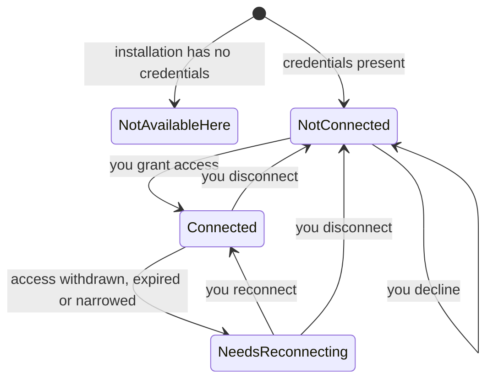
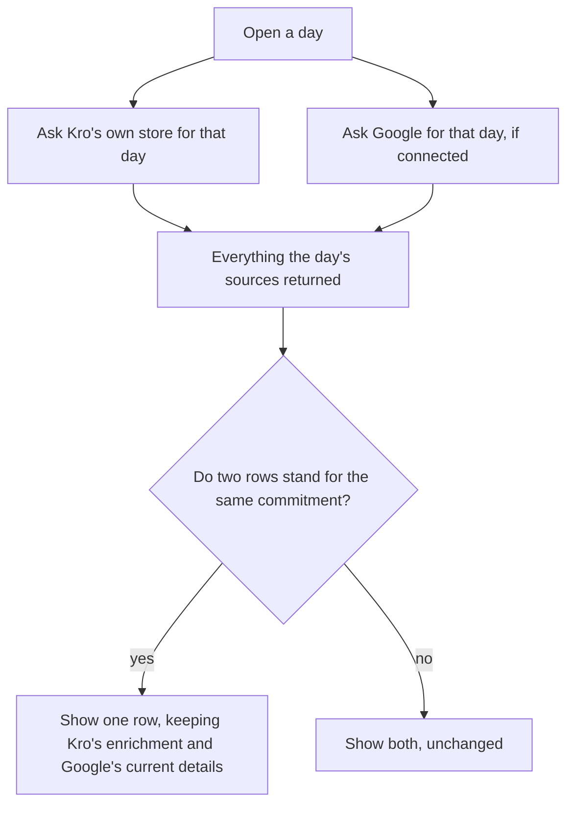
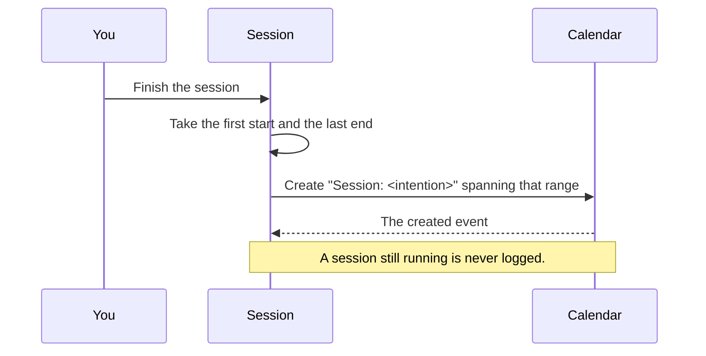

# Google Calendar

## Purpose

Kro is a federation, not an island: the meetings already on your Google Calendar
are part of your day whether or not Kro knows about them. Connecting Google
brings those events into Plan and Do alongside everything Kro hosts itself, with
each real-world commitment appearing exactly **once** even when Kro already holds
its own enriched copy. Connecting also gives finished focus sessions somewhere to
land, so a week of work leaves a record where the rest of your calendar lives.

Google Calendar is the flagship external host on the web. Apple Calendar and
Apple Reminders have no browser counterpart and are out of scope; the machinery
is host-agnostic, so a future provider is additive.

## Feature flag

- Name: `googleCalendarIntegration` (with `googleCalendar` covering the surfaces
  that present it)
- Default state: **enabled** — the integration ships on, matching the Apple app
- Rollout / sunset notes: the flag is a kill switch, not a rollout switch.
  Disabling it removes Google from the day's sources entirely; nothing else in
  the product changes, and nothing already saved is lost.

## Entry points

- **Integrations** — where you connect, see the connection's health, and
  disconnect. This is also where you land after granting or refusing access.
- **The reconnect banner** — appears on planning surfaces whenever Kro's access
  has stopped working. It is the only entry point that finds *you*.
- **Session conclusion** — finishing a focus session logs it, with no extra step,
  whenever Google is connected.

## Core concepts

- **Connection** — whether this browser currently has working access to your
  Google Calendar. Four states, described below.
- **Grant** — the permission you give Google to let Kro read and write your
  calendars. It survives closing the tab, and it is what you revoke when you
  disconnect.
- **Calendar** — one of the calendars in your Google account (your own, a shared
  team one, a holidays feed). Each event belongs to exactly one.
- **Event** — one occurrence on a calendar. A repeating meeting contributes one
  event per occurrence, not one for the whole series.
- **Kro's copy** — the enriched version Kro keeps of an event you have worked on:
  the same commitment, plus the value, effort, reward and session history Google
  has no place for.
- **Reconciliation** — the rule that a real-world commitment appears once. Kro's
  copy and the Google event are recognised as the same thing and shown as one.
- **Deployment configuration** — whether this installation of Kro has been given
  Google credentials at all. Not something you can change; the person running the
  deployment can.

## User flows

1. **Connecting.** From Integrations you choose to connect → Kro sends you to
   Google → Google asks whether Kro may see and change your calendars → you agree
   → you land back on Integrations, connected. Your calendars' events appear on
   the day you are looking at, without a reload of anything else.
2. **Refusing.** Same path, but you decline at Google's screen (or close it) →
   you land back on Integrations, still disconnected, with nothing changed. There
   is no error to dismiss; you simply did not connect.
3. **Seeing your day.** With Google connected, opening a day fetches that day's
   events from every calendar you can see. An event Kro already holds its own
   copy of appears once, carrying both Kro's enrichment and Google's current
   title and time. If one calendar cannot be read — a shared calendar whose
   permissions changed — the rest of the day still arrives.
4. **Losing access.** You revoke Kro's access from your Google account, or the
   permission expires → the next time Kro asks Google for anything, it is
   refused → the reconnect banner appears → choosing **Reconnect** runs the
   connect flow again → the banner disappears and your events return.
   A momentary network problem does **not** raise the banner.
5. **Logging a session.** You finish a focus session with an intention set →
   Kro writes a calendar event titled `Session: <your intention>`, spanning from
   when you started to when you stopped, in your own time zone. A session paused
   for lunch spans the lunch: the event records *when* the work happened.
   A session still running is never logged.
6. **Disconnecting.** From Integrations you disconnect → Kro tells Google to
   forget the permission and clears its own stored access → you are disconnected.
   If Google cannot be reached, Kro still forgets its access locally and tells
   you it could not reach Google, so you can revoke it there yourself.
7. **An unconfigured installation.** If this deployment has no Google
   credentials, Integrations says so and offers no Connect action. Everything
   else in Kro works normally; the day simply has no Google events on it.

## States

| State | What you see |
| --- | --- |
| **Not available here** | Integrations explains the installation has no Google credentials. No Connect action — pressing one could not work. |
| **Not connected** | Integrations offers **Connect**. Days show only what Kro hosts. |
| **Connected** | Integrations shows the connection and offers **Disconnect**. Days show your Google events, reconciled with Kro's own copies. |
| **Needs reconnecting** | The banner appears on planning surfaces and Integrations offers **Reconnect**. The wording differs depending on whether access was withdrawn, expired, or narrowed. Days show only what Kro hosts until you reconnect. |

The four are exclusive: Kro is never "connected and needing reconnection", and
"not connected" is never confused with "not available here" — one of those has a
button and the other cannot have one.

## Diagrams

### Connecting and losing access

### One commitment, one row

### Logging a finished session

## Interactions with other features

- **Plan and Do** read the day from every enabled source; Google is one of them.
  They do not know anything about Google specifically — they ask each source for
  a range and hand the combined result to reconciliation.
- **Reconciliation** is what makes a Google event and Kro's own copy appear once,
  and what keeps two occurrences of a repeating meeting apart. It also decides
  that anything Google hosts is presented as a calendar event, even when the copy
  Kro saved earlier remembers it as something else.
- **Sessions** hand a concluded session's intention and span to this feature; it
  owns the event's title and shape.
- **Visibility (the lens)** offers per-calendar hiding, using the calendar
  inventory this feature provides.
- **Settings / Integrations** owns the Connect, Reconnect and Disconnect actions
  and the connection's presentation.

## Out of scope

- **Editing a Google event from Kro.** Reading, and creating session events, only.
  Pushing a Kro edit back to a mirrored event needs the attach/detach path that
  does not exist on the web yet.
- **Attaching an existing Kro item to Google.** The inventory still lists Google
  as unavailable to attach, and says so.
- **Apple Calendar and Apple Reminders**, which have no browser counterpart, and
  **Outlook**, which is off in this product.
- **Sharing a connection across devices.** Connecting in one browser does not
  connect another. The permission is held per browser; connecting again elsewhere
  is the whole of the workaround.
- **Choosing which calendar a session is logged to.** Sessions go to your primary
  calendar.

## Open questions

- Should a connection be shared across a person's devices rather than held per
  browser? Doing so needs a place to keep the permission that this product does
  not own. Owner: @zheref, dated 2026-08-31.
- Should a session event be logged to a chosen calendar rather than the primary
  one? Owner: @zheref, dated 2026-08-31.
