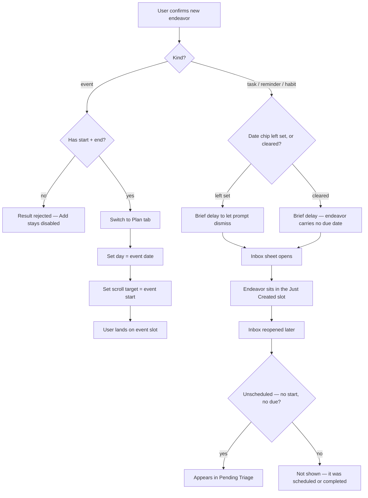
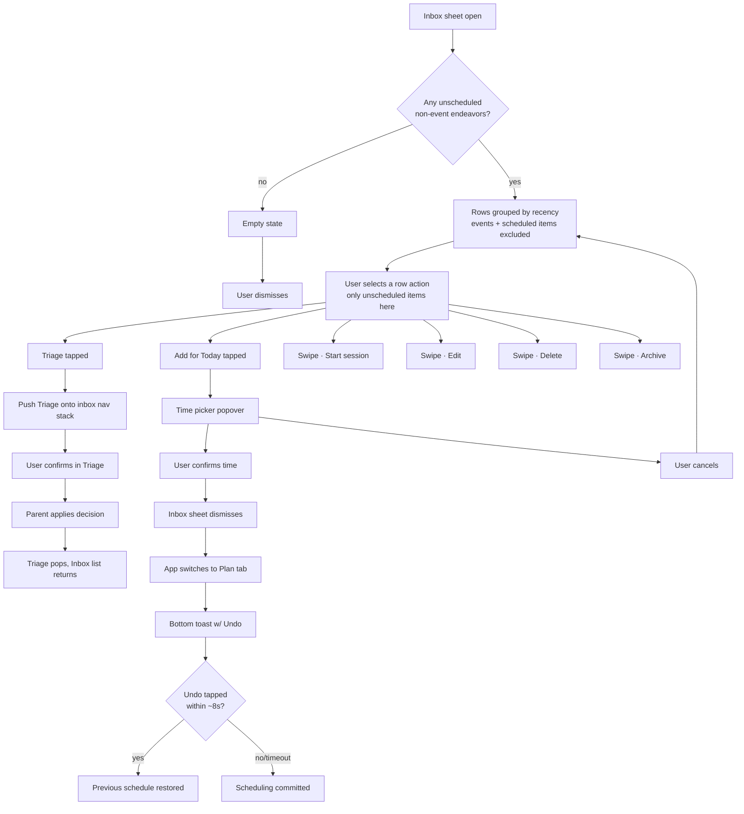

# Inbox

> The cross-platform behaviour is canon in `zheref/KroApple`'s own
> `docs/Features/Inbox.md`. This file is Kro Web's copy of that spec plus the
> **Web notes** section at the end, which is the only part that is
> web-specific. Where the two disagree, canon is right and this file is the
> bug.

## Purpose

The Inbox is a transient, recency-organized list of endeavors that the user
has just captured. Its job is to let the user *act on* fresh items quickly —
by triaging them into the Eisenhower matrix, scheduling them for today,
starting a session, or dismissing them — before they drift into the
longer-term backlog.

**The Inbox handles non-event endeavors only.** Calendar events bypass the
Inbox entirely: when the user captures an event, the app routes them straight
to the Plan tab and scrolls the day view to the event's time slot. See *User
flows* below.

## Feature flag

- Name: none (Inbox is always available for non-event captures)
- Default state: on
- Rollout / sunset notes: Inbox is a permanent surface. Specific buttons it
  shows ([Triage](./Triage.md), Add for Today) have their own per-feature
  gates.

## Entry points

- Appears automatically as a sheet (or, on desktop widths, a glass popover —
  see *Web notes*) shortly after the user captures a new non-event endeavor
  through the input prompt.
- Manually openable from the top-bar Inbox affordance.

## Core concepts

- **Endeavor** — a single user-captured intent (task, reminder, habit).
  Events are NOT inboxable.
- **Just Created** — the single non-event endeavor the user added in the last
  action; surfaced as its own row at the top of the sheet on the *first*
  presentation. On any subsequent open of the Inbox sheet, that endeavor moves
  into **Pending Triage** (the "Just Created" slot only fires once per
  capture).
- **Pending Triage** — every *unscheduled* non-event endeavor, with **no age
  bound** on either end. The Inbox is the catch-all for any endeavor that has
  never been triaged: brand-new captures (under 24 hours old) and
  long-neglected ones (weeks or months old) both appear here. An endeavor is
  "unscheduled" when it has neither a scheduled time (start) nor a due date.
- **Triage** — the act of deciding *where* an endeavor belongs (urgency /
  importance). See [Triage](./Triage.md).
- **Add for Today** — the act of scheduling an endeavor to a specific time on
  the current day.

## User flows

### 1. Capture an endeavor — kind decides routing

1. User confirms a new endeavor via the input prompt.
2. Kind branches:
   - **Event**: the input prompt enforces start + end at the Add button — the
     button is disabled until both times are picked. The app then switches to
     the **Plan** tab (after a brief delay so the input prompt finishes
     dismissing first) and opens the day in **list mode** — the chronological
     day list anchored at the event's row, highlighted with the "just
     created" accent. The Inbox **does not** open. This is the *only* path
     that auto-navigates a captured endeavor away from the Inbox.
   - **Task / Reminder / Habit**: the Inbox sheet opens after a brief delay
     (so the prompt has time to dismiss) with the new endeavor in the **Just
     Created** section and any other unscheduled items below it. Non-event
     captures never auto-navigate to the Plan tab — even when they would
     apply to today; the user reaches Plan only by explicitly using *Add for
     Today* on a row.
3. **A Task or Reminder can be captured with no date at all** — the date
   chip's Clear affordance (see *Web notes*) lets the user submit one with
   neither a start nor a due date, which is exactly what makes it eligible
   for Pending Triage the moment the Just Created slot drains. This is the
   product-level statement of the fix tracked as `KC-IS-#75`.
4. The user reviews / triages / schedules from there.

### 2. Triage an inbox row

See [Triage](./Triage.md) for the full flow.

### 3. Add an inbox row to Today

1. User taps the **Add for Today** button on a row.
2. A small popover appears anchored to the button, showing a time picker
   pre-filled with the next 15-minute slot after the current moment.
3. User adjusts the time and confirms, or cancels to back out.
4. On confirm:
   - The Inbox sheet dismisses.
   - The endeavor's due time is updated to the picked moment.
   - The app switches to the Plan tab.
   - A toast appears confirming the scheduling and offering **Undo**
     (auto-dismisses after about 8 seconds).
5. If the user taps **Undo** within the toast's lifetime, the endeavor's
   previous schedule is restored and the toast clears.

### 4. Quick actions via row swipes

- **Leading swipe** exposes **Start** (begin a focus session for the
  endeavor) and **Edit** (open the endeavor for editing).
- **Trailing swipe** exposes **Delete** (destructive) and **Archive**.

### 5. Empty state

When there is nothing to show, the sheet presents an empty-state illustration
and copy. No action affordances are present in that state.

## States

- **Loading** — the sheet uses the latest in-memory snapshot of endeavors, so
  there is no explicit loading state. New non-event captures are reflected
  immediately.
- **Populated** — at least one of *Just Created* or *Pending Triage* has
  rows (events are never counted).
- **Empty** — no rows in any section.
- **Triage pushed** — the Triage screen is mounted on top of the inbox list.
  The list is preserved underneath and re-appears when Triage closes.
- **Scheduling popover open** — the time-picker popover is anchored to a
  specific row's *Add for Today* button. Only one popover can be open at a
  time.

## Interactions with other features

- **[Triage](./Triage.md)** — the only entry point, and the surface Triage
  lives inside. On confirmation the Inbox re-reads its rows, which is what
  makes the triaged row disappear from Pending Triage.
- **Plan** — non-event endeavors hand off to Plan via *Add for Today* (with
  toast + Undo). **Events bypass the Inbox altogether** and hand off to Plan
  with a scroll target on the event's day + time.

## Out of scope

- Long-term backlog management.
- Bulk actions across multiple rows. All actions are row-scoped.
- Recurring endeavors — they appear like any other row but the Inbox does not
  expose their recurrence rules.
- **Calendar events.** They are explicitly excluded from every section and
  never auto-open the Inbox; this is invariant.

## Open questions

- Should the Pending Triage section grow to include items older than 7 days
  when the Inbox is empty otherwise? (Owner: PM. Inherited from canon,
  2026-05-19.)

## Diagrams

### Capture routing (events vs. non-events)

### Inbox interactions

## Web notes

Everything above is the shared spec. These are the decisions that exist only
because this is a browser.

- **Presentation.** The Inbox — and the capture prompt that feeds it — is a
  bottom sheet with a custom detent on a phone-width viewport and a glass
  popover anchored to the FAB's own corner on desktop, per `KC-IS-#24`'s web
  idiom for the pair.
- **The date chip's Clear affordance is a web-only addition, not a canon
  port (`KC-IS-#75`).** Canon's `EndeavorInputPrompt` date chip is always
  `isSet: true` and offers no way to unset it — only its time chips (start
  and, for an event, end) carry a Clear button. That leaves canon's own
  Pending Triage definition — *"every unscheduled non-event endeavor"* —
  unreachable through its own capture prompt for anything but a Habit, which
  never shows a date chip at all. This repo closes that gap by extending the
  same Clear-button idiom canon already uses for time to the date chip too,
  for Task and Reminder (never for Event, which has no way to represent a
  missing start). Upstream candidate for KroApple; recorded here rather than
  filed there, since this repo owns no authority over KroApple's canon.
- **The disabled Add control names what blocks it** in text, next to the
  button and referenced by it, because a disabled control leaves the
  reachable action surface entirely on the web. Canon has no equivalent — a
  disabled control there carries no explanation.
- **Dates and times use the browser's own date/time controls** rather than a
  wheel picker, reachable by keyboard and by screen reader without anything
  being built.
