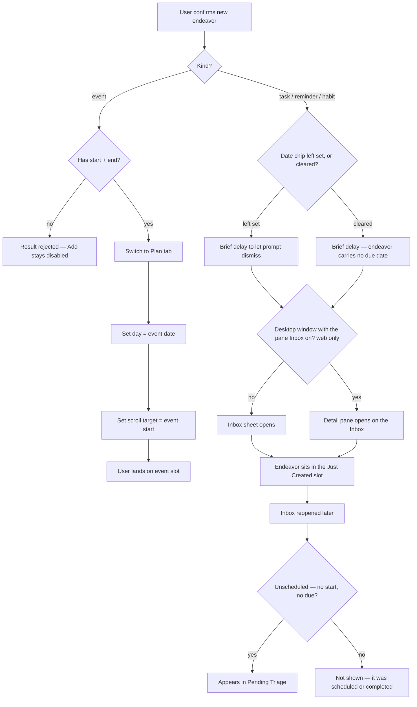
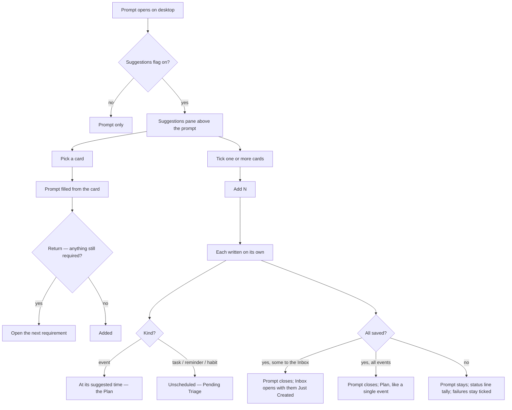
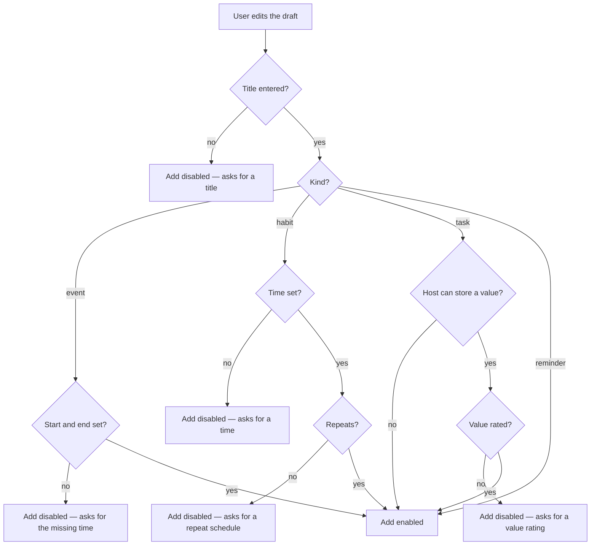
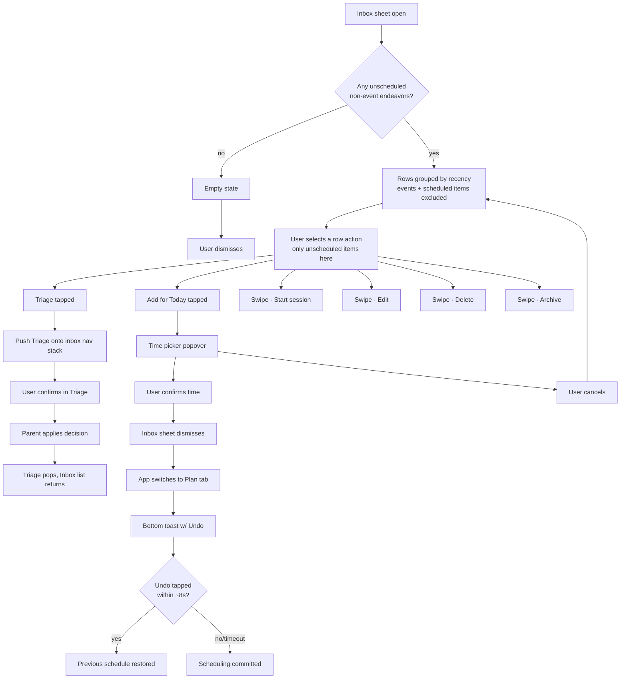

# Inbox

> The cross-platform behaviour is canon in `zheref/KroApple`'s own
> `docs/Features/Inbox.md`. This file is Kro Web's copy of that spec plus the
> **Web notes** section at the end, which is the only part that is
> web-specific. Where the two disagree, canon is right and this file is the
> bug.

## Purpose

The Inbox is a transient, recency-organized list of endeavors that the user
has just captured. Its job is to let the user *act on* fresh items quickly —
by triaging them into the Eisenhower matrix, scheduling them for today,
starting a session, or dismissing them — before they drift into the
longer-term backlog.

**The Inbox handles non-event endeavors only.** Calendar events bypass the
Inbox entirely: when the user captures an event, the app routes them straight
to the Plan tab and scrolls the day view to the event's time slot. See *User
flows* below.

## Feature flag

- Name: none (Inbox is always available for non-event captures)
- Default state: on
- Rollout / sunset notes: Inbox is a permanent surface. Specific buttons it
  shows ([Triage](./Triage.md), Add for Today) have their own per-feature
  gates.

## Entry points

- Appears automatically as a sheet (or, on desktop widths, a glass popover —
  see *Web notes*) shortly after the user captures a new non-event endeavor
  through the input prompt.
- Manually openable from the top-bar Inbox affordance.
- **Web only:** on the desktop window, the Inbox reading of the trailing detail
  pane (see [Mac Detail Pane](./MacDetailPane.md) and *Web notes*) — which is
  also where a new capture lands there.

## Core concepts

- **Endeavor** — a single user-captured intent (task, reminder, habit).
  Events are NOT inboxable.
- **Just Created** — the single non-event endeavor the user added in the last
  action; surfaced as its own row at the top of the sheet on the *first*
  presentation. On any subsequent open of the Inbox sheet, that endeavor moves
  into **Pending Triage** (the "Just Created" slot only fires once per
  capture).
- **Pending Triage** — every *unscheduled* non-event endeavor, with **no age
  bound** on either end. The Inbox is the catch-all for any endeavor that has
  never been triaged: brand-new captures (under 24 hours old) and
  long-neglected ones (weeks or months old) both appear here. An endeavor is
  "unscheduled" when it has neither a scheduled time (start) nor a due date.
- **Triage** — the act of deciding *where* an endeavor belongs (urgency /
  importance). See [Triage](./Triage.md).
- **Add for Today** — the act of scheduling an endeavor to a specific time on
  the current day.

## User flows

### 1. Capture an endeavor — kind decides routing

1. User confirms a new endeavor via the input prompt.
2. Kind branches:
   - **Event**: the input prompt enforces start + end at the Add button — the
     button is disabled until both times are picked. The app then switches to
     the **Plan** tab (after a brief delay so the input prompt finishes
     dismissing first) and opens the day in **list mode** — the chronological
     day list anchored at the event's row, highlighted with the "just
     created" accent. The Inbox **does not** open. This is the *only* path
     that auto-navigates a captured endeavor away from the Inbox.
   - **Task / Reminder / Habit**: the Inbox sheet opens after a brief delay
     (so the prompt has time to dismiss) with the new endeavor in the **Just
     Created** section and any other unscheduled items below it. Non-event
     captures never auto-navigate to the Plan tab — even when they would
     apply to today; the user reaches Plan only by explicitly using *Add for
     Today* on a row.
3. **A Task or Reminder can be captured with no date at all** — the date
   chip's Clear affordance (see *Web notes*) lets the user submit one with
   neither a start nor a due date, which is exactly what makes it eligible
   for Pending Triage the moment the Just Created slot drains. This is the
   product-level statement of the fix tracked as `KC-IS-#75`.
4. The user reviews / triages / schedules from there.

### 1a. What the input prompt asks for, per kind

The prompt's title row shows a **symbol badge** (the emoji the saved endeavor
will carry — a picked emoji, else one typed in the title, else a keyword
match), the title, and — for Tasks and Habits — the **reward points**. Tasks
open at 30 points and Habits at 10; switching kind re-seeds the number until
the user has changed it themselves.

Below it, the property row, in order: **value** and **duration** (Tasks and
Habits), **date** (not Habits), **time** ("Start" for Events), **end time**
(Events), **repeat**. Every set property that may be unset carries its own
clear control inside the same pill. Value is a 1–5 rating (Trivial, Minor,
Meaningful, Major, Life-changing); duration is one of Triage's preset lengths.
Tapping the selected star or preset clears it.

Add stays disabled, naming the first unmet requirement, in this order:

1. No title.
2. An Event missing its start and/or end.
3. A Habit missing its time, then a Habit that never repeats. A Habit opens
   with a time and an every-day repeat already set, and its time cannot be
   cleared.
4. A Task with no value rating — **only** when the chosen host can store one
   (on this device or Kro Cloud). A Task bound for Reminders is never blocked
   over a rating Reminders would drop.

The host picker offers only the hosts that can hold the chosen kind (Task and
Habit: Kro Cloud, this device, Reminders; Event: Calendar, Kro Cloud, this
device; Reminder: Reminders, this device), among those connected. Switching to
a kind the current host cannot hold moves the draft to that kind's first
supported host. A picked symbol replaces the first emoji in the saved title,
or is prepended when the title has none.

### 2. Triage an inbox row

See [Triage](./Triage.md) for the full flow.

### 3. Add an inbox row to Today

1. User taps the **Add for Today** button on a row.
2. A small popover appears anchored to the button, showing a time picker
   pre-filled with the next 15-minute slot after the current moment.
3. User adjusts the time and confirms, or cancels to back out.
4. On confirm:
   - The Inbox sheet dismisses.
   - The endeavor's due time is updated to the picked moment.
   - The app switches to the Plan tab.
   - A toast appears confirming the scheduling and offering **Undo**
     (auto-dismisses after about 8 seconds).
5. If the user taps **Undo** within the toast's lifetime, the endeavor's
   previous schedule is restored and the toast clears.

### 4. Quick actions via row swipes

- **Leading swipe** exposes **Start** (begin a focus session for the
  endeavor) and **Edit** (open the endeavor for editing).
- **Trailing swipe** exposes **Delete** (destructive) and **Archive**.

### 5. Empty state

When there is nothing to show, the sheet presents an empty-state illustration
and copy. No action affordances are present in that state.

## States

- **Loading** — the sheet uses the latest in-memory snapshot of endeavors, so
  there is no explicit loading state. New non-event captures are reflected
  immediately.
- **Populated** — at least one of *Just Created* or *Pending Triage* has
  rows (events are never counted).
- **Empty** — no rows in any section.
- **Triage pushed** — the Triage screen is mounted on top of the inbox list.
  The list is preserved underneath and re-appears when Triage closes.
- **Scheduling popover open** — the time-picker popover is anchored to a
  specific row's *Add for Today* button. Only one popover can be open at a
  time.

## Interactions with other features

- **[Triage](./Triage.md)** — the only entry point, and the surface Triage
  lives inside. On confirmation the Inbox re-reads its rows, which is what
  makes the triaged row disappear from Pending Triage.
- **Plan** — non-event endeavors hand off to Plan via *Add for Today* (with
  toast + Undo). **Events bypass the Inbox altogether** and hand off to Plan
  with a scroll target on the event's day + time.
- **Kro Cloud** — when a sweep lands rows after sign-in or launch, the inbox
  re-reads immediately; a capture hosted in Kro Cloud is sent as it is saved.

## Out of scope

- Long-term backlog management.
- Bulk actions across multiple rows. All actions are row-scoped.
- Recurring endeavors — they appear like any other row but the Inbox does not
  expose their recurrence rules.
- **Calendar events.** They are explicitly excluded from every section and
  never auto-open the Inbox; this is invariant.

## Open questions

- Should the Pending Triage section grow to include items older than 7 days
  when the Inbox is empty otherwise? (Owner: PM. Inherited from canon,
  2026-05-19.)

## Diagrams

### Capture routing (events vs. non-events)

```mermaid
flowchart TD
    capture[User confirms new endeavor] --> kind{Kind?}
    kind -->|event| validate{Has start + end?}
    validate -->|no| drop[Result rejected — Add stays disabled]
    validate -->|yes| planRoute[Switch to Plan tab]
    planRoute --> planDay[Set day = event date]
    planDay --> planScroll[Set scroll target = event start]
    planScroll --> planDone[User lands on event slot]
    kind -->|task / reminder / habit| dateChoice{Date chip left set, or cleared?}
    dateChoice -->|left set| inboxDelayDated[Brief delay to let prompt dismiss]
    dateChoice -->|cleared| inboxDelayDateless[Brief delay — endeavor carries no due date]
    inboxDelayDated --> where{Desktop window with the pane Inbox on? web only}
    inboxDelayDateless --> where
    where -->|no| inboxSheet[Inbox sheet opens]
    where -->|yes| inboxPane[Detail pane opens on the Inbox]
    inboxSheet --> justCreated[Endeavor sits in the Just Created slot]
    inboxPane --> justCreated
    justCreated --> reopen[Inbox reopened later]
    reopen --> pendingCheck{Unscheduled — no start, no due?}
    pendingCheck -->|yes| pendingTriage[Appears in Pending Triage]
    pendingCheck -->|no| gone[Not shown — it was scheduled or completed]
```

### 1b. Suggestions above the prompt (web-only, flagged)

Behind the `captureSuggestions` flag (off in the status-quo set, on in the
web's shipping build), the desktop prompt can show a second glass pane directly
above it. It is **hidden by default**: a sparkles button at the left of the
kind picker (or ⌥S) shows and hides it, and the choice is remembered on this
device. When shown, the pane sits at the same width and with the same rounded corners, holding a
scrolling grid of suggested endeavors — the Apple app's sample set, in its
order — laid out as many across as fit (two at the prompt's width). Each is
drawn as the Apple app's horizontal endeavor card: the emoji in a rounded tile
washed in the kind's colour, the title on one line (in full on hover), and the kind and reward points
beneath. The
pane fills the height above the prompt, leaving the standard gap above the
prompt and the standard margin below the top of the window.

- **Pick one:** any card can be picked, whatever kind the prompt is on.
  Clicking it (or focusing it and pressing Return) fills the
  prompt as the Apple app's carousel does — the title and its emoji, the
  kind with its defaults (the kind picker follows the card), the card's reward points as the user's own, and for
  an event a start and end from the card's suggested time and length. Return
  then adds it, or walks to anything still required (a task's value).
- **Add several at once:** tick cards of any kind with their checkbox,
  ⌥-click or Space (Shift+Space also works), then choose **Add N** (Shift+Return). With
  nothing ticked the action reads a neutral "Select to add" and is disabled.
  Each kind lands where a capture of it would: a task or reminder unscheduled
  in Pending Triage; a habit with its every-day rule and a time, also in
  Pending Triage; an event — which cannot be undated — at its suggested time
  and length, in the Plan. Rewards come with the kinds that earn them; value is
  decided at triage. Each item succeeds or fails on its own. When everything
  lands, the prompt closes and the user is taken where a single capture would
  take them: the Inbox — every added row in its Just Created slot, ready to
  triage — whenever at least one landed there (even if some events went to
  the Plan); the Plan, like a single event, when all of them were events. If
  any failed, the prompt stays open instead: the status line reports where
  things went ("Added 3 — 2 to Inbox, 1 to Plan") and the failures stay
  ticked for a retry.
- The pane is not shown on the phone sheet, and it hides when the room above
  the prompt could not show at least two rows.

```mermaid
flowchart TD
    open[Prompt opens on desktop] --> flag{Suggestions flag on?}
    flag -->|no| prompt[Prompt only]
    flag -->|yes| pane[Suggestions pane above the prompt]
    pane --> pick[Pick a card]
    pick --> filled[Prompt filled from the card]
    filled --> ret{Return — anything still required?}
    ret -->|yes| walk[Open the next requirement]
    ret -->|no| added[Added]
    pane --> tick[Tick one or more cards]
    tick --> addN[Add N]
    addN --> each[Each written on its own]
    each --> where{Kind?}
    where -->|event| plan[At its suggested time — the Plan]
    where -->|task / reminder / habit| inbox[Unscheduled — Pending Triage]
    each --> ok{All saved?}
    ok -->|yes, some to the Inbox| toInbox[Prompt closes; Inbox opens with them Just Created]
    ok -->|yes, all events| toPlan[Prompt closes; Plan, like a single event]
    ok -->|no| tally[Prompt stays; status line tally; failures stay ticked]
```

### What blocks Add

```mermaid
flowchart TD
    draft[User edits the draft] --> title{Title entered?}
    title -->|no| needTitle[Add disabled — asks for a title]
    title -->|yes| kind{Kind?}
    kind -->|event| times{Start and end set?}
    times -->|no| needTimes[Add disabled — asks for the missing time]
    times -->|yes| ok[Add enabled]
    kind -->|habit| habitTime{Time set?}
    habitTime -->|no| needHabitTime[Add disabled — asks for a time]
    habitTime -->|yes| habitRepeat{Repeats?}
    habitRepeat -->|no| needRepeat[Add disabled — asks for a repeat schedule]
    habitRepeat -->|yes| ok
    kind -->|task| host{Host can store a value?}
    host -->|no| ok
    host -->|yes| rated{Value rated?}
    rated -->|no| needValue[Add disabled — asks for a value rating]
    rated -->|yes| ok
    kind -->|reminder| ok
```

### Inbox interactions

```mermaid
flowchart TD
    sheet[Inbox sheet open] --> populated{Any unscheduled\nnon-event endeavors?}
    populated -- no --> empty[Empty state]
    populated -- yes --> rows[Rows grouped by recency\nevents + scheduled items excluded]
    empty --> dismissEmpty[User dismisses]
    rows --> chooseRow[User selects a row action\nonly unscheduled items here]
    chooseRow --> triage[Triage tapped]
    chooseRow --> aft[Add for Today tapped]
    chooseRow --> swipeStart[Swipe · Start session]
    chooseRow --> swipeEdit[Swipe · Edit]
    chooseRow --> swipeDelete[Swipe · Delete]
    chooseRow --> swipeArchive[Swipe · Archive]
    triage --> push[Push Triage onto inbox nav stack]
    push --> triageConfirm[User confirms in Triage]
    triageConfirm --> applied[Parent applies decision]
    applied --> pop[Triage pops, Inbox list returns]
    aft --> popover[Time picker popover]
    popover --> confirm[User confirms time]
    popover --> cancel[User cancels]
    cancel --> rows
    confirm --> dismiss2[Inbox sheet dismisses]
    dismiss2 --> planTab[App switches to Plan tab]
    planTab --> toast[Bottom toast w/ Undo]
    toast --> undo{Undo tapped\nwithin ~8s?}
    undo -- yes --> restore[Previous schedule restored]
    undo -- no/timeout --> done[Scheduling committed]
```

## Web notes

Everything above is the shared spec. These are the decisions that exist only
because this is a browser.

- **Presentation.** The Inbox — and the capture prompt that feeds it — is a
  bottom sheet with a custom detent on a phone-width viewport and a glass
  popover anchored to the FAB's own corner on desktop, per `KC-IS-#24`'s web
  idiom for the pair.
- **The Inbox in the detail pane (web-only divergence).** On the desktop
  window, behind the `detailPaneInbox` flag, the trailing detail pane offers an
  **Inbox** reading beside Session, Performance and Plan. It is the same Inbox —
  Just Created, Pending Triage, the same row actions — with the pane's header
  ("Inbox" and its close control) in place of the Inbox's own. **A capture that
  routes to the Inbox opens the pane on this reading instead of the overlay**,
  with the new item in Just Created, so Triage can start from it right away;
  Triage opens as a layer over the pane's list and returns to it. On a phone,
  or with the flag off, the overlay opens exactly as canon's does. Canon has no
  such reading.
- **The date chip's Clear affordance is a web-only addition, not a canon
  port (`KC-IS-#75`).** Canon's `EndeavorInputPrompt` date chip is always
  `isSet: true` and offers no way to unset it — only its time chips (start
  and, for an event, end) carry a Clear button. That leaves canon's own
  Pending Triage definition — *"every unscheduled non-event endeavor"* —
  unreachable through its own capture prompt for anything but a Habit, which
  never shows a date chip at all. This repo closes that gap by extending the
  same Clear-button idiom canon already uses for time to the date chip too,
  for Task and Reminder (never for Event, which has no way to represent a
  missing start). Upstream candidate for KroApple; recorded here rather than
  filed there, since this repo owns no authority over KroApple's canon.
- **The disabled Add control names what blocks it** in text, next to the
  button and referenced by it, because a disabled control leaves the
  reachable action surface entirely on the web. Canon has no equivalent — a
  disabled control there carries no explanation.
- **Hosts the browser cannot reach are never offered.** The per-kind host
  list is canon's, intersected with what is connected here — there is no
  Google Calendar host on the web prompt, and Reminders / Calendar appear
  only when a caller reports them connected.
- **An Event's end is not auto-filled from its start.** Canon resolves a
  missing end to start + the default event length; the web prompt keeps
  asking for both times explicitly.
- **Keyboard (web-only; canon defines no shortcuts here).** A capture can
  be completed without a pointer:
  - **Return** is never taken by a focused control (a property, a star, a
    preset). When nothing blocks the capture it adds it, from anywhere in the
    prompt. When something does, it moves to the next unmet requirement, in
    the order Add reports them — title, an event's start then end, a habit's
    time then repeat, a task's value — opening that editor with its field
    focused; optional properties are never visited. Setting the value returns
    to the title, so the next Return advances again or adds (a Task: type the
    title, Return, 3, Return). Inside the time editor, Return is that editor's
    Done. Nothing happens while an input method is composing text, and the
    blocking reason stays announced.
  - **Escape** closes the innermost thing first: an open editor or host list,
    then an open time edit (restoring the previous time), then the prompt.
  - **Option (⌥) chords** change properties, matched on the physical key so
    macOS's Option characters do not interfere, and no Cmd/Ctrl combination
    the browser owns is taken:
    ⌥1–4 kind (Task, Habit, Event, Reminder) · ⌥J symbol · ⌥↑ / ⌥= and
    ⌥↓ / ⌥− reward points (shown as ⌥↑↓) · ⌥V value · ⌥U duration · ⌥D date · ⌥T time
    (start, for an event) · ⌥E end (events) · ⌥R repeat · ⌥H host · ⌥S into
    the suggestions grid and back, opening the pane first if it is hidden. In
    the grid, ← / → move one card and ↑ / ↓ one row; Return picks the card
    into the prompt and returns to the title (the next Return adds, or walks
    to what is still required); Space ticks and unticks; Escape returns to the
    title; Shift+Return adds the ticked cards.
  - With the value, duration, repeat or host list open, **1–9** picks that
    option, closes the list and returns to the title; digits are not typed
    into the title meanwhile. Date and time open with their field focused and
    are entered with the browser's own keyboard entry.
  - On the desktop popover, holding Option fades in a small keycap over the
    top-leading corner of each control naming its chord — the kind segments,
    the symbol badge, the reward points, every property and the host — and
    releasing it (or leaving the window) fades them out again, the way Mac
    menus reveal shortcuts. The keycaps float over the controls and take no
    space, so the property row never widens, wraps or scrolls because of them. Each also
    names its chord as a tooltip, and the status line shows what to press
    next (see *One status line*). The phone sheet shows no
    hints; the keys still work where a keyboard is attached.
- **The prompt floats in.** On the desktop the prompt — and its suggestions
  pane, when shown — slides in with a fade from the bottom-right corner where
  the quick-action button sits, and slides back out the same way when it is
  dismissed; showing or hiding the pane animates it the same way. With
  Reduce Motion on, both appear and disappear at once.
- **One corner radius for the prompt and its pane.** Both use the design
  system's surface radius, and the prompt's dark status band follows it at
  its bottom corners, so nothing squares off the rounded panel.
- **One status line.** The line under Add is the only place the prompt says
  what blocks it — including a required value, which names the host that
  demands it ("Pick a value rating — required for On Device"); the value
  editor draws no second notice, only the value property's orange glyph. The
  line has a fixed height: a reason too long for one line is cut short with
  an ellipsis, and its full text is still announced. On the desktop popover,
  when the last input was a key press, the line also says what to press
  next — the open editor's keys, "⏎ next" while something is still required,
  or "Ready · ⏎ Add" — and the reason's tail is cut before the keys are. A
  pointer press returns it to the reason alone. Screen readers hear only the
  reason, never the key hints.
- **Dates and times use the browser's own date/time controls** rather than a
  wheel picker, reachable by keyboard and by screen reader without anything
  being built.
