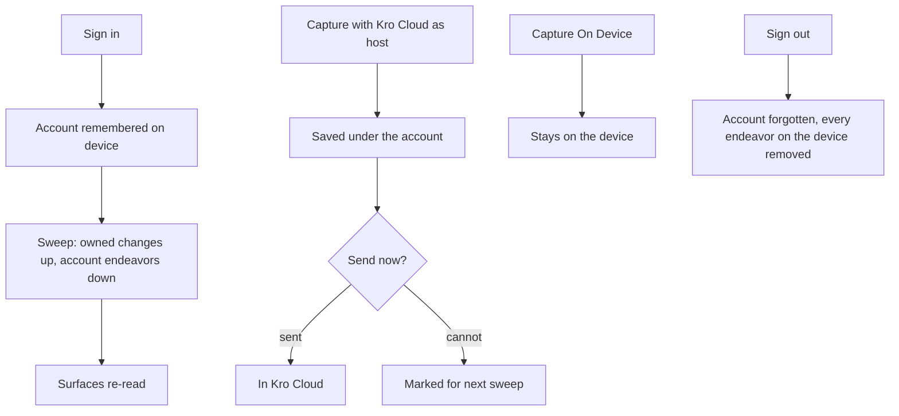

# Kro Cloud

## Purpose

Kro Cloud is the account-backed home for a person's endeavors: sign in once, and
the endeavors hosted there follow the account to every device. On the web it is
the only reason to sign in — a signed-in user with no cloud data would be signed
in to nothing — so the web build ships it on.

## Feature flag

- Name: `supabaseHosting`
- Default state: **enabled on the web**; Apple stages the same flag remotely.
- A device-level debug switch can still turn it off; the shipping override is
  the product's, the debug switch is the developer's, and the second layers on
  the first rather than replacing it.

## Entry points

- The profile control in the shell toolbar: sign in with email, Apple or
  Google (see [Settings](./Settings.md)).
- The capture prompt's host picker, which offers **Kro Cloud** beside On
  Device only while an account is signed in on this device.

## Core concepts

- **Host** — where an endeavor lives: on this device only, or in Kro Cloud
  under the account. Chosen when the endeavor is created; an edit never moves
  it.
- **Owned endeavor** — a Kro Cloud endeavor: it carries the account that owns
  it, and only that account can read or change it.
- **Sweep** — the exchange run after a launch restore or a sign-in: local
  changes to owned endeavors go up, the account's endeavors come down.
- **Remembered account** — after sign-in, the device keeps the account's
  identity (name, emails, avatar, join date, sign-in provider, and the
  account id the sweep needs) until sign-out. Nothing else is kept, and a
  launch that finds no session forgets it.

## User flows

1. **Sign in on a new device.** Sign in; the account is remembered; a sweep
   brings the account's endeavors down; every surface showing endeavors —
   My Day, the tasks vista, the search lens, Plan, Inbox — re-reads on the
   spot. If the device already held endeavors made while signed out, Kro asks
   what to do with them first.
2. **Create in the cloud.** Capture an endeavor with Kro Cloud as its host: it
   is written under the account and sent immediately. If the send cannot
   happen (offline, refused), the endeavor is saved and marked for the next
   sweep; nothing is lost and nothing is reported as sent.
3. **Create on the device.** Capture with On Device as the host: it stays on
   the device, is never sent, and is offered for adoption at the next sign-in.
4. **Edit.** Editing a cloud endeavor sends the edit immediately; editing a
   device endeavor keeps it on the device. An edit never changes an endeavor's
   host.
5. **Return from a provider.** Apple and Google leave the app and come back to
   the page the person left; a first return provisions the account's profile.
6. **Sign out.** The remembered account is forgotten and every endeavor on
   the device is removed — account-owned and device-hosted alike, the same
   sweep Settings describes. What was hosted in Kro Cloud returns at the next
   sign-in; what was only on the device does not.
7. **Offline or unconfigured.** A build with no Kro Cloud project configured,
   or a device that cannot reach it, runs local-only; sign-in says it is
   unavailable rather than failing.

## States

- *Signed out* — Kro Cloud is not a host; everything is on the device.
- *Signed in, sweep pending* — the account is remembered; surfaces show what
  the device holds until the sweep lands.
- *Signed in, synchronised* — the account's endeavors are on the device and
  every owned change goes up as it happens.
- *Signed in, sweep failed* — the device keeps working; owned changes stay
  marked for the next sweep.
- *Unavailable* — no cloud project configured for this build.

## Interactions with other features

- **Settings** — hosts the sign-in surface and the profile control; the
  account-scoped preferences travel through the same account.
- **Do, Find, Plan, Inbox** — each re-reads its endeavors when a sweep lands
  rows (see each feature's own notes).
- **Triage** — a triaged endeavor is sent the same way a created one is.

## Out of scope

- Vista filters and lens snapshots stay on the device; only endeavors sync.
- Sharing an endeavor with another account.

## Diagrams

### Hosting and sync

## Open questions

- Should the host picker remember Kro Cloud as the default once an account is
  signed in? Owner: maintainer, 2026-09-20.
