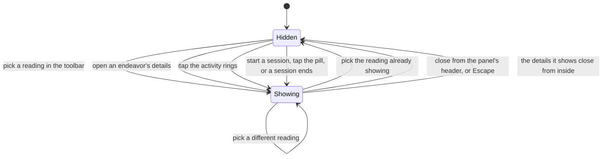
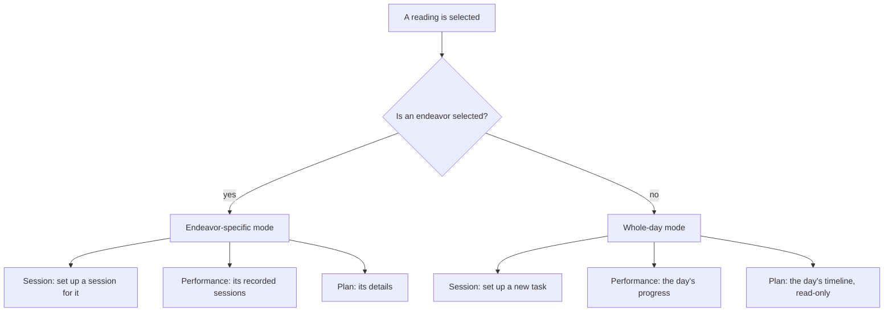

# Mac Detail Pane

> Cross-platform canon: KroApple `docs/Features/MacDetailPane.md`. This spec
> describes the same feature; web-only differences are under **Web notes**.

## Purpose

On a desktop window, one glass panel runs along the window's trailing edge, and the user
chooses what it holds. It can show three readings: how a session is set up, how the work
is going, and what the day looks like. Each reads either the endeavor currently selected
or, when nothing is selected, the whole day.

The panel belongs to the **window**, not to whichever destination is showing. There is
exactly one, so everything that moves aside for "the panel" (the floating action button)
moves aside for the same thing every time.

**Desktop layout only.** In the phone layout these surfaces stay sheets. Nothing here
changes that layout.

## Feature flag

- Name: `macDetailPane`
- Default state: enabled, as in canon.
- Rollout: a kill switch rather than a dark launch. Turning it off removes the
  toolbar group and the moved entry points: an endeavor's details open in a
  centred dialog and a session opens on its own destination, as before.

## Entry points

- **The toolbar group in the window's content toolbar**, on the trailing side just
  before Notifications and Profile: one capsule of three icons, one per reading
  (Session, Performance, Plan), only one of which is ever selected. Picking one shows the panel
  with that reading. Picking the one already showing hides the panel.
- **An endeavor's details**: double-clicking a card, long-pressing it, or choosing
  Details from its secondary-click or overflow menu, from any surface. This opens Plan in
  its endeavor-specific mode.
- **The activity rings in the Do header**: open Performance in its whole-day mode,
  Day Progress. The rings span both rows of the large title and are always shown; on a day with nothing to count
  both tracks are drawn empty, so this entry point never disappears.
- **Starting a session**: Execute on a card, Start Session on a Plan block, or
  Start Session from the floating action button opens Session in the panel. The
  first two set up a session for that endeavor; the third sets up a new task.
- **The session pill**: while a session runs and the panel is not showing it,
  the pill stays on screen; tapping it opens Session in the panel.
- **A session ending**: when a countdown ends, Session opens in the panel to
  show the conclusion, whatever the panel was showing.

## Core concepts

- **Panel**: the glass surface along the window's trailing edge. There is exactly one,
  and it always belongs to the window.
- **Reading**: one of the three things the panel can show. The toolbar names them.
- **Selected endeavor**: the endeavor the panel is reading. With none selected, every
  reading widens to the whole day. The selection is kept when the panel is hidden, so
  reopening a reading returns to the same endeavor.
- **Resting position**: where the floating action button sits while the panel is hidden.
  While the panel shows, the button moves aside by the panel's width plus a small gap.

## The three readings

| Reading | With an endeavor selected | With none selected |
| --- | --- | --- |
| **Session** | Session setup for that endeavor | Session setup for a new, arbitrary task |
| **Performance** | That endeavor's recorded sessions ([EndeavorActivity.md](./EndeavorActivity.md)) | The whole day's progress ([DayProgress.md](./DayProgress.md)) |
| **Plan** | That endeavor's details | The day's timeline, read-only |

The panel's header names what it is showing. A reading with an endeavor is titled
*Session Setup*, *Endeavor Activity* or *Details*, with the endeavor's name beneath. A
whole-day reading is titled *New Session*, *Day Progress* or *Timeline*, with no subtitle.

The day's timeline is the same canvas the Plan tab draws, for today, shown without any
way to edit it: no opening a block, no dragging, no rescheduling, no creating from an
empty hour, and no day picker. It keeps the hours the Plan tab's day range shows, marks
the current minute, and scrolls with the panel. It opens scrolled to the current
minute, with a little of the past hour above it. It is for looking at the shape of the
day while working somewhere else in the window.

One block on it is not an event: a **session preview**, marking where a new session
would sit if started right now. It starts at the current minute, lasts as long as
Session Setup would set a new task to, and is drawn the way a recorded session is (the
reward colour, a dashed outline, a timer mark) so it reads as a proposal rather than a
commitment. It carries a **Start** control, the one thing on the timeline that responds:
it drills into Session Setup for a new task, ready to start, and Back returns to the
timeline.

## User flows

1. **Choosing a reading.** The user picks a button in the toolbar. The panel slides in
   from the trailing edge carrying that reading, and the floating action button moves
   aside to clear it.
2. **Swapping readings.** With the panel open, the user picks a different button. The
   panel stays where it is and its contents change. The previous reading is released,
   so nothing keeps working behind a panel that is showing something else.
3. **Hiding the panel.** The user picks the button already showing, uses the close
   control in the panel's header, or presses Escape. The panel slides out and the button
   returns to its resting position.
4. **Opening an endeavor's details.** The user double-clicks a card, or picks Details
   from its menu. The panel opens on Plan with that endeavor selected. Doing it for
   another endeavor switches the panel to the new one. Editing a detail (a field, the
   duration, a relation) happens inside the panel, with Back and Save at the top of its
   body.
5. **Setting up a session.** The user presses Execute on a card. The panel
   opens on Session with that endeavor's title, glyph and recommended duration,
   ready to start. Once started, the session runs in the panel, and the pill
   takes over when the panel is hidden or showing something else. Pressing the
   Session button with nothing selected sets up a new, unnamed task instead.
   A session that is already running is never replaced by opening Session on
   another endeavor.
6. **A session ends.** The panel opens on Session showing the conclusion. If
   the user hides the panel or moves to another reading without choosing, the
   pill keeps the conclusion, as it does everywhere else.
7. **Closing details from inside.** If the endeavor's details close for another reason,
   such as the endeavor being deleted, the panel hides with them.

### Drilling in

Some readings open another from inside the panel, as a drill-in. The first is
**Show sessions** in Session Setup's header, which opens that endeavor's
activity. A drilled-in reading slides in from the trailing edge. Its header
shows **Back** instead of the close control, and Back (or Escape) slides back
to where it came from. Choosing a reading from the toolbar, or closing the
panel, forgets the whole trail.

### The panel's own chrome

Each reading keeps its controls **inside** the panel: a close control at the leading
edge, then the reading's title, then the endeavor's name in an endeavor-specific mode.
The window's toolbar is never used for this.

## States

- **Hidden**: no reading selected. The button is at its resting position, and none of
  the three toolbar buttons is pressed.
- **Showing a whole-day reading**: the header names the reading, with no subtitle.
- **Showing an endeavor-specific reading**: the header names the reading, with the
  endeavor's name beneath.
- **Phone layout**: the panel and the toolbar group are absent. A panel left open when
  the window narrows reappears when it widens again.

## Diagrams

### Choosing, swapping and dismissing

### Which mode a reading picks

## Interactions with other features

- **Endeavor Detail**: on the desktop layout with the flag on, details open in the
  panel's Plan reading instead of a dialog. Leaving Plan, or hiding the panel, closes
  them. Reselecting Plan reopens them on the same endeavor.
- **Session**: on the desktop layout with the flag on, starting a session opens
  it in the panel instead of moving to the Execute destination, which stays
  reachable from the sidebar. The pill hides while the panel shows the session.
- **Do / Plan**: their floating action buttons move aside while the panel shows.
- **App Shell** ([AppShell.md](./AppShell.md)): the panel and its toolbar group are
  part of the desktop shell.

## Web notes

- The desktop layout on the web is the sidebar shell. It is the equivalent of the Mac
  window, and it is the only place the panel appears.
- **Escape closes the panel.** Canon has no Escape binding here; on the web, Escape is
  the platform's standard way to close a floating surface. It only acts when nothing
  inside the panel (a menu, a dialog) handled Escape first. Inside a drill-in (an
  editor in the details, or any reading showing Back) Escape goes back one level
  rather than closing the panel.
- The session preview is web-only: canon's read-only timeline has no preview block.
- The read-only timeline reads today's calendar on its own rather than sharing the Plan
  tab's loaded day, because the Plan tab may be showing another day. It asks the same
  calendars, so the two agree whenever both show today. Filters set in the Plan tab do
  not narrow it.
- The panel floats over the page, which keeps its full width and scrolls underneath it.
  Its measurements follow canon's: 96 from the top, 16 from the trailing and bottom
  edges, rounded corners of 28, and a width of 36% of the window, never below 320 or
  above 520.

## Out of scope

- Resizing or detaching the panel.
- Editing from the read-only timeline. The Plan tab remains where the day is changed.
  Start on the session preview only opens Session Setup; it records nothing until the
  session is started there.
- A second panel inside a destination's own content.

## Open questions

- None open.
