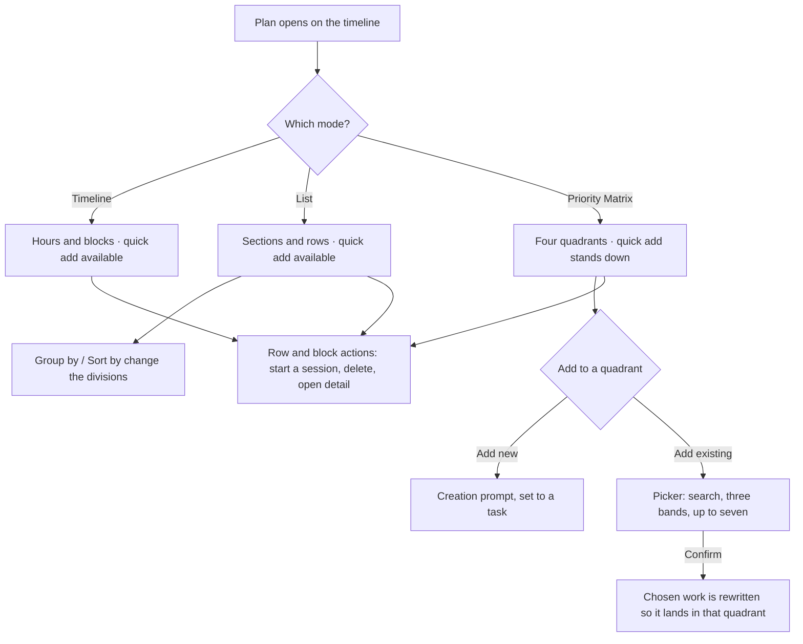
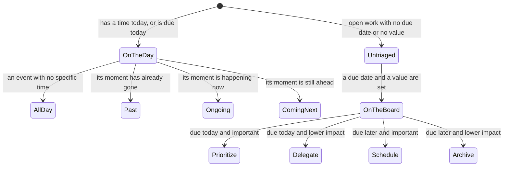
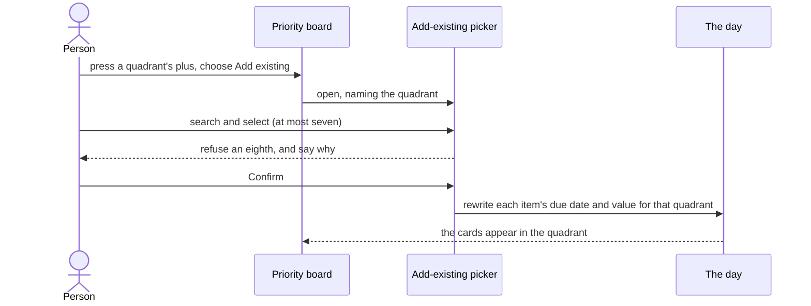

# Plan

## Purpose

Plan is where a person looks at **one day** and decides what it is going to be.
It answers three different questions about that same day, and it answers them
without ever leaving the tab: *when is everything?* (a timeline against the
hours), *what is everything?* (a list, grouped however the person prefers), and
*what actually matters?* (a priority board that sorts open work by urgency and
value). The day being examined is chosen from a strip of five days that slides
under the selection, so stepping forward and back is a single tap.

## Feature flag

- Name: `timelineQuickEventCreation`
- Default state: **enabled**
- Governs only the press-an-empty-hour shortcut on the timeline. Plan itself is
  not gated: the three modes, the day strip, the visibility filters and the
  priority board are always available. Two other flags change what Plan can do
  without owning it — the endeavor detail sheet is dark-launched behind its own
  flag (see [`./AppShell.md`](./AppShell.md)), and the calendar integration
  behind its own (see [`./GoogleCalendar.md`](./GoogleCalendar.md)).

## Entry points

- The **Plan** tab on a narrow window, and the **Plan** sidebar row on a wide
  one. Both land on the timeline for today.
- A direct link to the Plan address, which opens the same surface — the address
  is the authority for which destination the shell highlights.
- The creation prompt hands back to Plan after a timed item is captured, landing
  on the day and hour it was created for.

## Core concepts

- **Day** — the single date every mode is about. One day is selected at a time.
- **Mode** — which of the three faces of that day is on screen: **Timeline**,
  **List**, or **Priority Matrix**. Switching is a rotary control in the header,
  and the new mode slides in from the side it sits on.
- **Endeavor** — anything on the day: an event, a task, a habit, a reminder.
- **All-day item** — an event that occupies the whole day rather than a slot.
- **Temporal bucket** — where an item sits relative to *now*: All Day, Past,
  Ongoing, or Coming Next.
- **Grouping** — how the list divides the day: by nothing (the four temporal
  buckets), by project, or by time of day. A saved preference.
- **Sort** — how items order inside those divisions: by time, by priority, or by
  title. A saved preference.
- **Quadrant** — one of the four cells of the priority board: **Prioritize**
  (urgent and important), **Schedule** (important, later), **Delegate** (urgent,
  lower impact), **Archive** (lower impact, later).
- **Triage data** — an item's due date and its value. An item missing either is
  *untriaged* and belongs to no quadrant at all.
- **Visibility filters** — which kinds, sources, calendars and states the day
  shows. Saved, and shared by the timeline and the list.

## User flows

1. **Read the day.** Open Plan → the timeline draws today's hours with a line at
   the current minute → tap a day chip, or the arrows either side, to move → the
   day re-reads, and the days either side are fetched quietly so the next step is
   instant.
2. **Change what the day is about.** Turn the mode control → the chosen face
   slides in. The quick-add button is present over the timeline and the list, and
   **stands down over the priority board**, because each quadrant carries its own
   ways to add.
3. **Work the list.** Switch to List → the day appears as rows, divided into All
   Day, Past Events, Ongoing and Coming Next → press *Group by* to divide by
   project or by time of day instead, or *Sort by* to reorder within the
   divisions. Both choices are remembered, and the same two choices appear in
   Settings.
4. **Act on a row.** On a touch screen, swipe a row from the leading edge to
   start a session on it, or from the trailing edge to delete it; press and hold
   for the same two as a menu. With a pointer, the identical pair appears on
   hover and on right-click. A labelled control beside every row opens its
   detail.
5. **Read the board.** Switch to Priority Matrix → four tinted quadrants fill the
   screen and do not scroll; only the cards inside a quadrant do. Each quadrant
   names itself, says what it means in one line, and shows how many cards it
   holds. Only open tasks and tracker tickets that carry **both** a due date and
   a value appear — anything untriaged is deliberately absent rather than filed
   under Archive.
6. **Add to a quadrant.** Press the quadrant's plus → choose **Add new**, which
   opens the creation prompt already set to a task, or **Add existing**, which
   opens the picker. An empty quadrant shows both as plain buttons in its body,
   so a blank cell explains itself.
7. **Pick existing work.** In the picker, search by title → results appear in
   three bands, Today first, then work that already has triage data, then work
   that has none → select up to **seven**; at seven the remaining rows stop
   responding and a line says why. Confirm is refused until at least one is
   chosen, and says so. Confirming rewrites each chosen item's due date and value
   so that it *lands* in that quadrant — the quadrant itself is never stored.
8. **Filter the day.** Press the eye in the toolbar → a panel offers exactly the
   filter families this surface declares: states, kinds, calendars and sources. A
   ticked row means *shown*. The eye itself turns struck-through while anything
   is hidden. The filters narrow the timeline and the list together and change
   nothing about progress rings anywhere in the app.
9. **Unhappy paths.** A day that fails to load says so with a retry. A calendar
   grant that has stopped working shows a reconnect banner above the day. A
   read-ahead window that fails leaves the previous one in place rather than
   emptying the surrounding days. A day with nothing on it says so plainly
   instead of drawing empty section headers.

## States

| State | What the person sees |
| --- | --- |
| **Loading** | The refresh control becomes a spinner; the previous day stays on screen until the new one arrives. |
| **Loaded — timeline** | Hours, blocks placed against them, a line at the current minute when today is selected. |
| **Loaded — list** | Section headers with rows beneath; the section containing something happening right now is marked. |
| **Loaded — board** | Four quadrants, each with its cards, count and add control. |
| **Empty day** | One honest message, no section headers and no empty quadrant scaffolding. |
| **Empty quadrant** | The quadrant's own two ways to add, in its body. |
| **Failed** | A message naming what failed, with a retry when retrying can help. |
| **Needs reconnect** | A banner above the day offering to reconnect the calendar. |
| **Filtered** | The eye is struck through; the timeline and list show less. |
| **Picking** | A panel over the board: search, three bands, a running count out of seven, and a Confirm that names what blocks it. |

## Diagrams

### Modes and the surfaces they open

### How an item finds its place

### Picking existing work into a quadrant

## Interactions with other features

- **Creation prompt** — Plan opens it pre-set: to an event when an empty hour is
  pressed (carrying that hour), and to a task from a quadrant's *Add new*.
- **Endeavor detail** — every row, block and card opens detail through the same
  request; detail is presented by the app shell, not by Plan.
- **Session** — starting a session from a row hands off to the session surface.
  Today that hand-off opens the surface without carrying the chosen item; see
  Open questions.
- **Settings** — the list's grouping and sort are the same two preferences the
  Plan section of Settings offers, and either surface writes the same values.
- **Calendar integration** — the day is read from every connected source; a
  broken grant shows its banner here, and is reconnected from here.
- **App shell** — the day-scoped quick-add button, its highlight, the toolbar
  slots and the sheet-versus-popover choice all belong to the shell; Plan asks
  for them rather than deciding them.

## Out of scope

- The **standalone** priority-matrix destination. The board *inside* Plan is
  shipped; the separate board screen remains a vote surface.
- The focused single-quadrant screen a quadrant header opens on Apple. There is
  no equivalent screen here yet; the count beside the quadrant name carries the
  fact it would have shown.
- Triage itself — deciding an item's value and due date through the triage flow
  is a different feature. Plan only *reads* triage data, plus the one rewrite the
  picker performs.
- Progress rings. Plan's filters never touch them.
- Calendar and reminder sources that only exist on Apple devices.

## Open questions

- **Carrying an item into a session.** Starting a session from a Plan row opens
  the session surface but does not yet hand it the chosen item. Owned by the
  session feature. *(2026-08-31)*
- **Persisting a quadrant assignment.** Confirming the picker rewrites the chosen
  work immediately on screen; writing that change to storage waits on the Plan
  feature growing the effect for it. *(2026-08-31)*
- **Project names.** Project sections are titled with the project's identifier
  because no name lookup exists yet — the same gap the Apple app records.
  *(2026-08-31)*
- **Calendar list.** The Calendars filter family is declared and drawn, and says
  plainly that no calendars have loaded, because nothing fetches the list of
  calendars yet. *(2026-08-31)*
