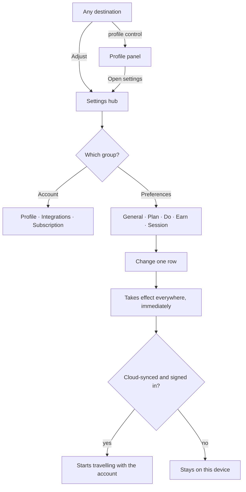
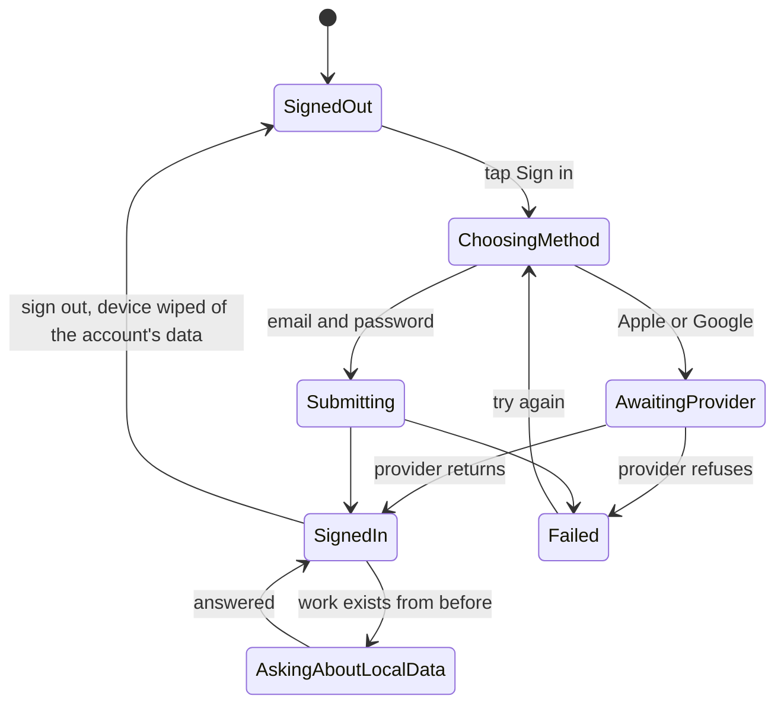

# Settings

## Purpose

Settings is where a person tells Kro how they want it to behave, and where they
see and change who they are signed in as. It is one hub with three groups —
their account, their preferences, and the outside services Kro talks to — so
that "change something about Kro" is one place rather than a hunt across the
surfaces the setting affects.

Every preference here is the same preference the iPhone and Mac apps offer,
under the same name, so somebody who uses Kro on two devices is changing one
idea rather than learning two.

## Feature flag

- Name: `settings`
- Default state: **enabled**
- The hub is the Adjust destination the shell offers. Individual rows inside it
  are not separately flagged; a preference belonging to a feature that is itself
  switched off simply has nothing to affect.

Two rows are gated by something other than a flag:

- The **cloud-synced** preferences behave differently when nobody is signed in —
  they still change locally, and they start travelling the moment an account
  exists.
- **Subscription** is a placeholder: it names what will live there and offers
  nothing to press.

## Entry points

- The **Adjust** destination, from the sidebar on a desktop-shaped window and
  from the tab bar's Settings control on a phone-shaped one.
- The **profile control** in the shell's toolbar, which is present on every
  destination. Tapping it opens a small panel with who you are and a way into
  the hub; on a phone-shaped window that panel is a sheet from the bottom edge.
- The **sign-in surface**, which any part of the app can raise and which
  returns you where you were.

## Core concepts

- **Hub** — the list of everything Settings can take you to, in three groups.
- **Group** — *Account* (who you are, what Kro is connected to, what you pay
  for), *Preferences* (how each surface behaves), *Integrations*.
- **Section** — one screen inside the hub: General, Plan, Do, Earn and Session
  preferences, plus Profile, Integrations and Subscription.
- **Option** — one thing a person can change. Every option knows its own kind
  (a switch, a choice from a list, a number, a time of day), its own default,
  and the glyph that stands for it.
- **Snapshot** — everything currently chosen, read once when Settings opens and
  written back one option at a time.
- **Cloud-synced subset** — the options that travel with an account rather than
  staying on the device.
- **Session** — who is signed in. Absent is a normal state, not an error.
- **Local data** — work created before signing in. Signing in asks what to do
  with it rather than deciding silently.

## User flows

1. **Change a preference.** Open Adjust → pick a section → change a row. The
   change takes effect immediately, everywhere, with no Save step. If it is one
   of the cloud-synced options and an account exists, it starts travelling.
2. **Find who you are signed in as.** Tap the profile control from any
   destination. The panel names the account, or offers to sign in if there is
   none.
3. **Sign in.** From the profile panel or from anywhere that needs an account.
   Choose email, Apple or Google. Apple and Google leave the app and come back;
   Kro picks up where you were, on whatever page the provider returned you to.
4. **Sign in with work already on the device.** Kro asks what to do with it
   before anything moves, and does nothing until you answer.
5. **Sign out.** Everything private to the account is removed from the device;
   the debug overrides a developer set are deliberately left alone.
6. **Connect a calendar.** Integrations lists the providers, says which are
   connected, and offers to connect or disconnect each. A provider that cannot
   be reached says so rather than appearing connected.
7. **A preference that cannot be read.** The option shows its declared default.
   Kro does not show an error over a screen that otherwise works.

## States

| State | What the person sees |
| --- | --- |
| *Loading* | The hub's rows, with their values still settling. Nothing is editable for the moment it takes. |
| *Ready* | Every row with its current value. |
| *Signed out* | The profile row invites signing in; the account group's other rows explain what an account would add. |
| *Signed in* | The account's name and how it was signed in; sign-out is offered. |
| *Signing in* | The chosen method's own step, and a way back. |
| *Sign-in failed* | What went wrong, in words, with the form still filled in. |
| *Local data found* | A choice about the work already on the device, blocking nothing else. |
| *Sync unavailable* | The cloud-synced rows still change; a footer says they are not travelling yet. |

## Interactions with other features

- **App shell** — Settings is a destination the shell offers, and the profile
  control lives in the shell's own toolbar so it is reachable from everywhere.
- **Plan** — Plan reads four of its preferences from here: the band of hours the
  day shows, whether finished items stay on the timeline, and the default sort
  and grouping for its list. Changing one in Settings changes the Plan surface
  immediately, because Plan reads this snapshot rather than keeping a copy.
- **Do**, **Earn**, **Session** — each reads its own group the same way.
- **Sync** — the cloud-synced subset travels with the account; everything else
  stays on the device.

## Out of scope

- Subscription and billing. The section names itself and offers nothing.
- Notification permissions, which the browser owns and Kro can only ask for.
- Per-device preferences. Every preference here is one idea per person.

## Diagrams

### Getting to a preference

### Signing in

## Open questions

- Whether a preference should ever be per-device rather than per-person. Nothing
  in the schema allows it today, and nothing has asked for it. — unowned,
  2026-09-01.
- What Subscription actually offers. — unowned, 2026-09-01.
