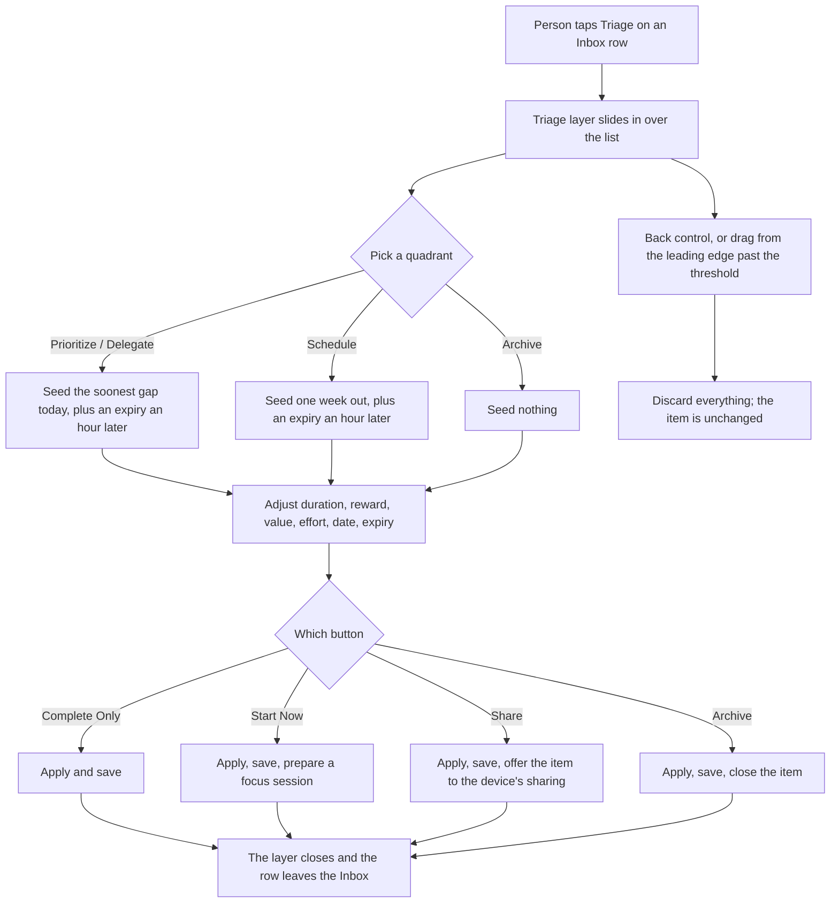
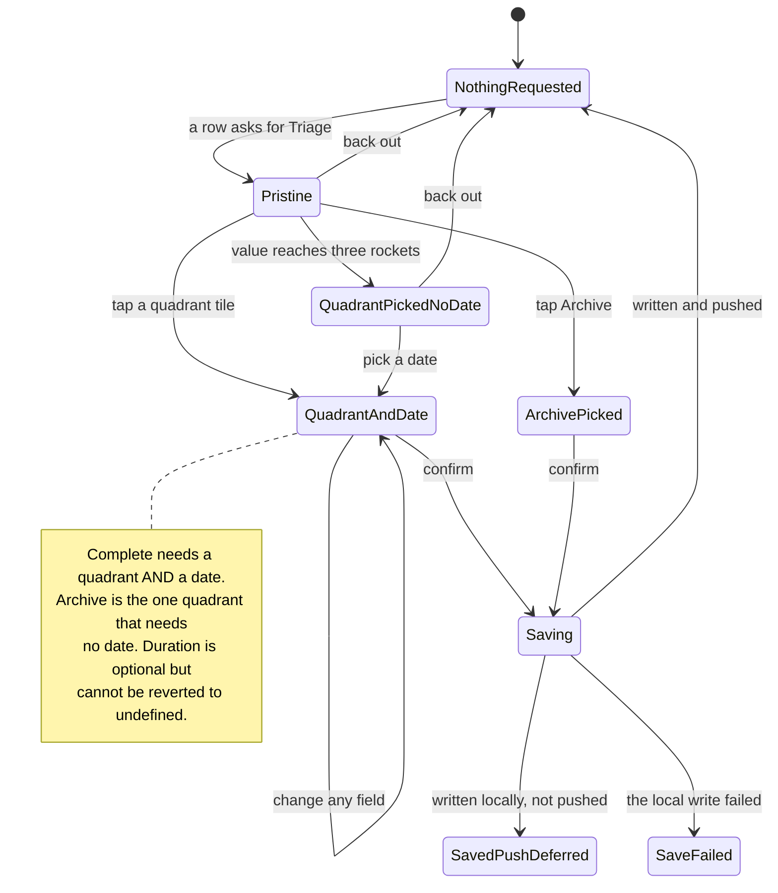
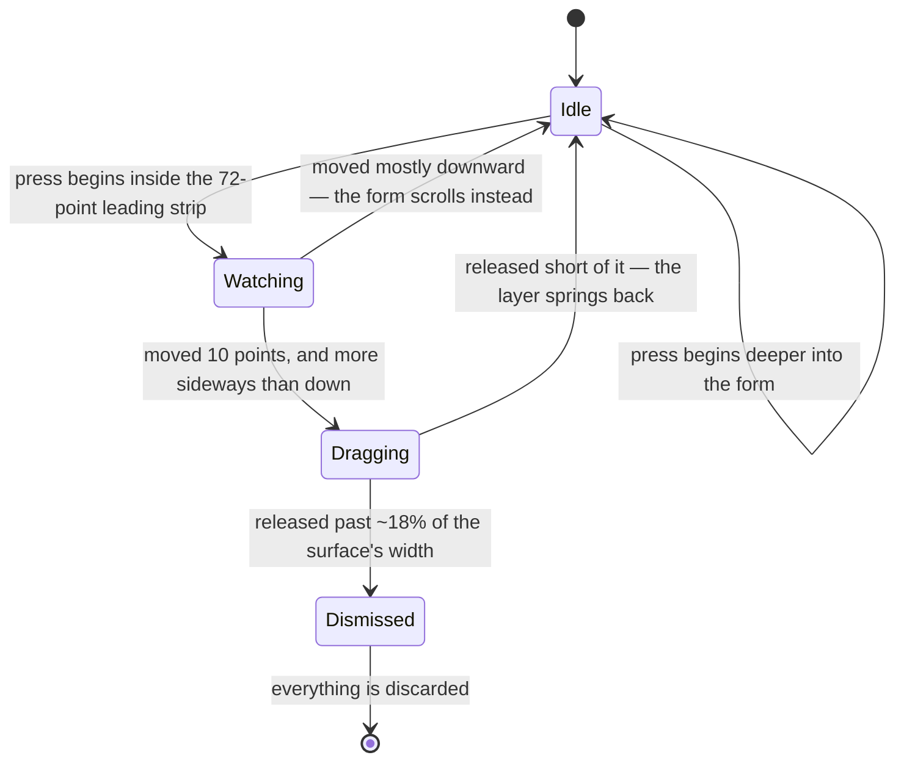

# Triage

> The cross-platform behaviour is canon in `zheref/KroApple`'s own
> `docs/Features/Triage.md`. This file is Kro Web's copy of that spec plus the
> **Web notes** section at the end, which is the only part that is web-specific.
> Where the two disagree, canon is right and this file is the bug.

## Purpose

Triage is the screen a person sees when they need to decide what to *do* with
one thing they captured — classify it on the urgency × importance axes, commit
to how long it will take, and give it a date. It is a focused,
one-thing-at-a-time surface that gets a real decision made before items pile up.

## Feature flag

- Name: `triage`
- Default state: enabled
- Rollout notes: the flag wraps the Triage surface itself. The Inbox's Triage
  button is always visible; with the flag off, tapping it is a no-op because
  nothing applies the decision.
- A second, separate flag — `endeavorDetail` — dark-launches the inline **Edit**
  affordance described below. It is **disabled** in the shipped default set, so
  the affordance is not shown today.

## Entry points

- The **Triage** button on a row in the Inbox. Triage opens *inside* the Inbox
  surface as a second layer over the list; the Inbox stays open underneath and
  a person can back out to it without losing anything.
- Both Inbox presentations offer it: the overlay a capture routes into, and the
  Jot Down destination.
- There is no address for Triage. It is not a place you can link to or land on;
  it is a layer over the Inbox, and it exists only while the Inbox does.

## Core concepts

- **Item** — the one thing being triaged. It arrives with its title, its emoji
  and its identity; every choice made here is applied to it on confirmation.
- **Quadrant** — one of four cells:
  - **Prioritize** (urgent · important) — schedule it into the soonest gap
    today big enough to hold it.
  - **Schedule** (important · not urgent) — pick a future date; the default is
    one week out.
  - **Delegate** (urgent · not important) — hand it off; the date defaults the
    same way Prioritize's does, because Delegate is also in the urgent column.
  - **Archive** (neither) — put it away, with no date required.
- **Default scheduled date** — picking a quadrant seeds a sensible date *only
  when nothing has been picked yet*. The urgent column forces both a date and a
  matching expiry; Archive seeds neither.
- **Value ↔ importance link** — one-way in each direction. Setting value to
  three rockets or more promotes the quadrant into the important row, keeping
  whichever urgency was already chosen and defaulting to Schedule when nothing
  was. Picking an important quadrant raises a lower value up to three. Lowering
  value never demotes the quadrant, and picking a not-important quadrant never
  lowers value.
- **Effort × reward** — *raising* the effort rating multiplies the reward by the
  same ratio (two flames to four doubles it). Lowering effort leaves the reward
  alone, so nobody loses points by being honest. The result stays within 1–999.
- **Duration** — how long it will take, picked from a row of chips: a minute, 5,
  15, 25, 45, 60, 90, two hours, three hours. It starts undefined and can be
  changed from one chip to another, but **never back to undefined** — there is
  no Skip affordance.
- **Expiry** — when the commitment stops being worth keeping. Whenever a
  scheduled date exists, an expiry exists too; clearing it snaps it back to an
  hour after the date rather than leaving the pair inconsistent.
- **Decision** — the bundle of choices handed back on confirmation.

## Layout

Top to bottom:

1. **Header** — a back control, the item's emoji, the word "Triage" over the
   item's title, and a reward badge that tracks the stepper live and stays
   visible however far the form is scrolled.
2. **Reward points** — a stepper. It moves by five below fifty and by ten at
   fifty and above, and stays between one and 999.
3. **Duration** — the chip row, scrolling sideways, with no Skip chip.
4. **The matrix** — a two-by-two grid with the urgency words above and the
   importance words down the left. An unpicked tile shows its two axes in
   words, with the positives set heavier than the negations. The picked tile
   shows its name, a one-line caption, its own colour and a check mark.
5. **Value** — five rockets, with the descriptor for the current step shown
   beside them: *Trivial / Minor / Meaningful / Major / Life-changing*. Tapping
   the current rating clears it. The default is one rocket.
6. **Scheduled date** — a date-and-time control, or a button that reveals one
   when no date has been picked.
7. **Expires at** — once a date exists, one sideways-scrolling row: a
   date-and-time control at the leading edge, then preset pills — *At the
   moment, An hour later, 2h later, 4h later, EoD, EoW* — and an informational
   **Custom** indicator that lights when the chosen moment matches no preset.
   Picking anything moves the matching pill to the front of the row and scrolls
   back to the leading edge so the choice stays in view. Without a date the
   section falls back to a plain control and an "Add an expiry" button.
8. **Effort** — five flames, laid out like Value: *Autopilot / Easy /
   Cumbersome / Hard / Grueling*. Default one flame.
9. **The action row** — anchored to the bottom with the form scrolling behind
   it.
   - Before a quadrant is picked, one full-width **Complete Triage**, disabled,
     and a line of text naming what is missing.
   - After a quadrant is picked, the primary shrinks to **Complete Only** and a
     quadrant-specific second button appears beside it: **Start Now** (green)
     for Prioritize, nothing for Schedule, **Share** (orange) for Delegate,
     **Archive** (grey) for Archive.
   - Both buttons keep their full presence when disabled; the disabled state is
     shown by a change of colour, never by fading them out.
   - Behind the dark-launch flag, an **Edit** row sits underneath, opening the
     full editing surface without applying or discarding anything.

### Prefill

Every field the source item already carries is filled in: its reward points,
its duration, its date, its value, its effort and its expiry (or an hour after
the seeded date when it has none). **The quadrant is never prefilled** — it is
the decision the screen exists for.

## User flows

### 1. Triage one item

1. Tap **Triage** on an Inbox row.
2. The Triage layer slides in over the Inbox list, carrying the item's emoji
   and title.
3. Optionally pick a duration chip.
4. Tap a quadrant tile. That highlights it, seeds a date when none was picked,
   seeds the matching expiry, and raises a low value into the important range
   when the quadrant is an important one.
5. Optionally adjust the date, the expiry, the reward, the value and the effort.
6. Tap **Complete Only** to commit, or the quadrant's own second button.
7. The layer closes, the decision is saved, and the row leaves the Inbox.

### 2. Back out without deciding

Two equivalent ways, and both discard everything:

- Tap the back control in the header.
- Drag right, starting inside a 72-point strip along the leading edge —
  generous enough to hit comfortably without intercepting taps deeper into the
  form. Releasing past roughly 18% of the surface's width completes the
  dismissal; releasing earlier springs the layer back.

### 3. Confirm with no duration

Allowed. Only a quadrant and a date are required, and Archive does not even
need the date. Whatever duration the item already had is kept.

### 4. Hand it off

Picking Delegate and tapping **Share** saves the decision, then offers the
item to whatever the device uses for sharing, pre-filled with a short
Kro-branded line. The layer closes when that hand-off ends, whether it was
completed or cancelled.

### 5. Start it immediately

Picking Prioritize and tapping **Start Now** saves the decision and then
prepares a focus session for that item.

## Persistence on confirm

The decision is applied and then saved, in this order:

- **Archive** closes the item. It stays in the data so it can be found again;
  it simply stops appearing in active lists.
- **Every other quadrant** writes the date and the duration back onto the item:
  both set reschedules it, a date alone updates the date and records an audit
  entry, and a duration alone keeps the existing start.
- The result is written to the device first — that is the durability
  guarantee, and a failure there is the one case where the decision was truly
  not captured. Only then is it pushed to wherever the item lives. A push that
  does not land changes nothing about the local save; it is reported and the
  decision stands.

## States

- **Nothing requested** — the layer is not present at all; the Inbox is
  untouched.
- **Pristine** — open, nothing picked. Complete is disabled and says a quadrant
  is missing.
- **Quadrant picked, no date** — reachable by promoting through the value
  rating, which sets a quadrant without seeding a date. Complete is disabled
  and now says the date is missing.
- **Quadrant and date picked** — Complete is enabled, and the quadrant's own
  second button is beside it.
- **Archive picked** — a special case of the above: no date, and Complete is
  enabled anyway.
- **Saving** — the layer has already closed; the surface reports that the write
  is running.
- **Saved, push deferred** — the decision is safe on the device; a line says the
  remote copy has not caught up.
- **Save failed** — the one alarming state, and the only one where the decision
  was lost. It is raised as an alert and the form is not re-prompted.

## Interactions with other features

- **Inbox** — the only entry point, and the surface Triage lives inside. On
  confirmation the Inbox re-reads its rows, which is what makes the triaged row
  disappear from Pending Triage.
- **Focus session** — Start Now prepares a session for the item.
- **Item editing** — behind the dark-launch flag, the inline Edit affordance
  opens the editing surface for the same item without applying a decision.

## Out of scope

- Triaging more than one item at a time.
- Custom quadrants; the four are fixed.
- Breaking an item into sub-tasks.
- Mirroring the triaged item into an external calendar or reminder service
  beyond the standard remote save.

## Web notes

Everything above is the shared spec. These are the decisions that exist only
because this is a browser.

- **Triage is a layer, never an address.** Canon presents it through the
  Inbox's own carousel rather than a navigation push, because the Triage screen
  draws no background of its own and a transparent screen breaks the system push
  animation. The web keeps the decision for that reason and a second one: the
  Inbox is a modal surface, and navigating away from it would close the very
  thing Triage is supposed to sit inside.
- **The layer travels alone.** Canon slides the Inbox list out to the left as
  Triage slides in, so the two move as one strip. Here the Triage layer travels
  over an opaque panel instead: the edge strip, both thresholds and the release
  decision are identical, and what is missing is the list's parallax.
- **Completing the escape drag closes immediately** rather than springing the
  layer out first. The rule that decides *which* release closes it is the
  ported one; the settling animation is not, because every dependency-free way
  of running it can strand the layer when a person has asked for reduced motion.
- **The drag never steals a tap.** A gesture only becomes a drag once it has
  travelled ten points and is more sideways than downward; until then, taps
  reach the controls they landed on and the form scrolls normally.
- **Dates use the browser's own date-and-time control** rather than a floating
  panel. It is the closest equivalent to the compact control canon uses, and it
  is reachable by keyboard and by screen reader without anything being built.
- **Sharing degrades honestly.** Where the browser offers a share sheet, that is
  what is used. Where it does not, the line is copied to the clipboard and the
  surface says so, so the hand-off never silently does nothing.
- **The disabled Complete control names what blocks it** in text, next to the
  button and referenced by it, because a disabled control leaves the reachable
  action surface entirely on the web. Canon has no equivalent — a disabled
  control there carries no explanation.
- **After the layer closes, the surface keeps a one-line status.** The write
  outlives the form, so "saving", a failed local save and a deferred push are
  reported on the Inbox surface itself rather than on a screen that has already
  gone.

## Open questions

- Should Archive move the item into a separately-browsable archive rather than
  simply closing it? (Owner: PM. Raised 2026-05-19, inherited from canon.)
- Should the duration default be inferred from similar past items? (Owner:
  data. Raised 2026-05-19, inherited from canon.)
- Should Prioritize also pick a duration when none is chosen, so it can
  reschedule immediately? (Owner: design. Raised 2026-05-19, inherited from
  canon.)
- Should the escape drag reproduce the paired slide once the Inbox list can
  accept a transform from the layer above it? (Owner: web. Raised 2026-08-31.)

## Diagrams

### User flow

### States

### The escape gesture

